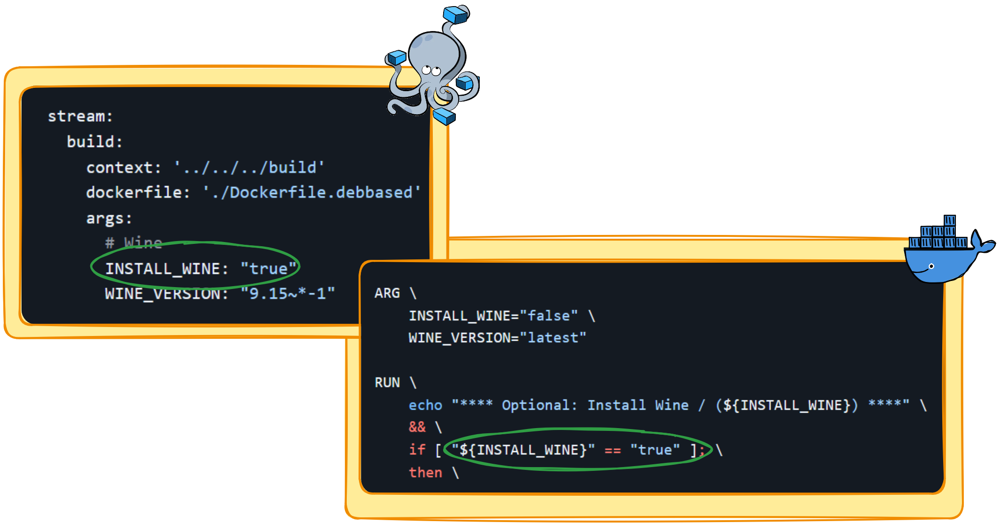

   

##
<!--- WIP --->

<!---
#####################################################
# Development - Structure - Monolithic
#####################################################
--->  
#### Development - Structure - Monolithic
[(Back to Development)](../../../README.md#table-of-contents-4)
 

The Dockerfile encompasses all the essential components required for a seamless gaming experience, with management and orchestration handled by Supervisor.

 

   <table>
      <tr align="center">
          <td><strong></strong></td>
          <td><strong>Component</strong></td>
          <td><strong>Description</strong></td>
          <td><strong>Purpose</strong></td>
      </tr>
      <tr>
         <td rowspan="9">Core Component</td>
      <tr>
      <tr align="left">
          <td>Supervisord</td>
          <td>Process control system for managing and monitoring services.</td>
          <td>To ensure that the core components and applications are running smoothly and automatically restart them if they fail.</td>
      </tr>
      <tr align="left">
          <td>Kde-Plasma</td>
          <td>Desktop Environment</td>
          <td>Provides a graphical interface for user interaction</td>
      </tr> 
      <tr align="left">
          <td>D-Bus</td>
          <td>Message bus system</td>
          <td>Facilitates communication between processes</td>
      </tr> 
      <tr align="left">
          <td>PipeWire</td>
          <td>Multimedia server</td>
          <td>Handles audio and video streams</td>
      </tr> 
      <tr align="left">
          <td>Selkies-Gstreamer</td>
          <td>Media processing framework</td>
          <td>Rremote desktop streaming platform</td>
      </tr>   
      <tr align="left">
          <td>xvfb</td>
          <td>X virtual framebuffer</td>
          <td>Provides a display server for graphical applications</td>
      </tr>
      <tr align="left">
          <td>Coturn</td>
          <td>TURN and STUN server</td>
          <td>Provides NAT traversal for WebRTC</td>
      </tr>
      <tr>
         <td rowspan="9">Optional Component</td>
      <tr>
       <tr align="left">
           <td>VirtualGL</td>
           <td>Open-source software</td>
           <td>Enables OpenGL applications to run on a remote server</td>
       </tr>
       <tr align="left">
           <td>Wine</td>
           <td>Compatibility layer</td>
           <td>Allows Windows applications to run on Linux</td>
       </tr>
       <tr align="left">
           <td>Lutris</td>
           <td>Gaming platform</td>
           <td>Manages and launches games from various sources</td>
       </tr>
       <tr align="left">
           <td>Steam</td>
           <td>Digital distribution platform</td>
           <td>Offers games and software for purchase and download</td>
       </tr>
       <tr align="left">
           <td>Heroic Launcher</td>
           <td>Game launcher</td>
           <td>Manages and launches games from the Epic Games Store</td>
       </tr>
       <tr align="left">
           <td>WirePlumber</td>
           <td>Session manager</td>
           <td>Manages PipeWire sessions and connections</td>
       </tr>
       <tr align="left">
           <td>Firefox-Nightly</td>
           <td>Web browser</td>
           <td>Provides a testing version of the Firefox browser with the latest features</td>
       </tr>
   </table>

##

<code>What is this, Granny? Some outdated sysadmin techniques?</code>
    
  

##

Each additional component has its own arguments to include during the build process, also you can choose the appropriate version of each component.

> [!NOTE]
> Each `RUN` block in the Dockerfile is independent — it doesn't rely on any other RUN blocks, allowing you to rearrange them as needed.

##

<code>Build Arguments? Who's using those? Come on, bro!</code>
       
  

##

   

