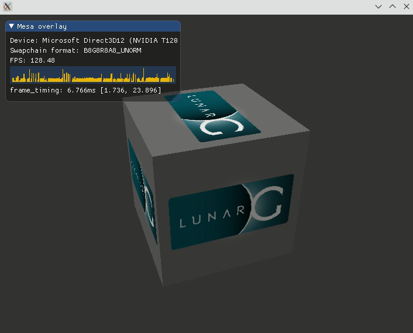

<div align="center">
   
</div>

<!---
$$\      $$\  $$$$$$\  $$\       
$$ | $\  $$ |$$  __$$\ $$ |      
$$ |$$$\ $$ |$$ /  \__|$$ |      
$$ $$ $$\$$ |\$$$$$$\  $$ |      
$$$$  _$$$$ | \____$$\ $$ |      
$$$  / \$$$ |$$\   $$ |$$ |      
$$  /   \$$ |\$$$$$$  |$$$$$$$$\ 
\__/     \__| \______/ \________|
--->
## WSL

Throughout my exploration of WSL, I've gathered key insights about graphics rendering. It turns out that relying on EGL rendering isn't the best option. However, using the software renderer (llvmpipe) can still provide you some gaming experience - atleast terraria works 😉

> [!WARNING]
> - Vulkan isn't functioning properly; only selected linux-native games are working.
> - Performance is lacking; you can only play very lightweight games.

> [!Note]
> - `Terraria` - playable.
> - `Torchlight II` - playable.
> - `Divinity: Original Sin - Enhanced Edition` - unplayable.

##

<!---
$$$$$$$$\ $$\       $$$$$$$\  $$$$$$$\  
\__$$  __|$$ |      $$  __$$\ $$  __$$\ 
   $$ |   $$ |      $$ |  $$ |$$ |  $$ |
   $$ |   $$ |      $$ |  $$ |$$$$$$$  |
   $$ |   $$ |      $$ |  $$ |$$  __$$< 
   $$ |   $$ |      $$ |  $$ |$$ |  $$ |
   $$ |   $$$$$$$$\ $$$$$$$  |$$ |  $$ |
   \__|   \________|\_______/ \__|  \__|
--->
### TLDR: 
> [!NOTE]
> - Consider this as a POC.
> - WSL setup can be useful for software-rendering usage.
> - The command below are designed to leverage the NVIDIA GPU.

```sh
docker run -d --name stream --hostname stream --cap-add NET_ADMIN --cap-add SYS_ADMIN --cap-add SYS_NICE --cap-add IPC_LOCK --security-opt seccomp=unconfined --security-opt apparmor=unconfined --ipc host --tmpfs /dev/shm:rw,size=64m --device /dev/dri/card0 --device /dev/dri/renderD128 --device /dev/dxg -e STREAMER_HOST="${STREAMER_HOST}" -e MESA_D3D12_DEFAULT_ADAPTER_NAME="NVIDIA" -e LIBVA_DRIVER_NAME="d3d12" -e VK_ICD_FILENAMES="/usr/share/vulkan/icd.d/dzn_icd.x86_64.json" -e LD_LIBRARY_PATH="/usr/lib/wsl/lib" -v /usr/lib/wsl:/usr/lib/wsl:ro --gpus all -p 8080:8080 -p 3478:3478/udp -p 3478:3478/tcp -p 8091:9091 ghcr.io/utilizable/metal/full-ubuntu:latest
```
##

<!---
$$$$$$$$\  $$$$$$\   $$$$$$\  
\__$$  __|$$  __$$\ $$  __$$\ 
   $$ |   $$ /  $$ |$$ /  \__|
   $$ |   $$ |  $$ |$$ |      
   $$ |   $$ |  $$ |$$ |      
   $$ |   $$ |  $$ |$$ |  $$\ 
   $$ |    $$$$$$  |\$$$$$$  |
   \__|    \______/  \______/
--->
### Table Of Contents:
- Setup
   - [Setup - Windows](#setup---windows)
   - [Setup - Linux - WSL](#setup---linux---wsl)
- [Configuration](#configuration)
   - [Configuration - WSL](#configuration---wsl)
   - [Configuration - Linux - WSL](#configuration---linux---wsl)
- [Usage](#usage)
  
<!---
$$$$$$$\  $$$$$$$\  $$$$$$$$\ $$\    $$\ $$$$$$\ $$$$$$$$\ $$\      $$\ 
$$  __$$\ $$  __$$\ $$  _____|$$ |   $$ |\_$$  _|$$  _____|$$ | $\  $$ |
$$ |  $$ |$$ |  $$ |$$ |      $$ |   $$ |  $$ |  $$ |      $$ |$$$\ $$ |
$$$$$$$  |$$$$$$$  |$$$$$\    \$$\  $$  |  $$ |  $$$$$\    $$ $$ $$\$$ |
$$  ____/ $$  __$$< $$  __|    \$$\$$  /   $$ |  $$  __|   $$$$  _$$$$ |
$$ |      $$ |  $$ |$$ |        \$$$  /    $$ |  $$ |      $$$  / \$$$ |
$$ |      $$ |  $$ |$$$$$$$$\    \$  /   $$$$$$\ $$$$$$$$\ $$  /   \$$ |
\__|      \__|  \__|\________|    \_/    \______|\________|\__/     \__|
--->
<h2>Preview</h2>
<div align="center">
<sup><code>d3d12 renderer is utilizing</code></sup>
<br>

</div>

<!---
 $$$$$$\  $$$$$$$$\ $$$$$$$$\ $$\   $$\ $$$$$$$\  
$$  __$$\ $$  _____|\__$$  __|$$ |  $$ |$$  __$$\ 
$$ /  \__|$$ |         $$ |   $$ |  $$ |$$ |  $$ |
\$$$$$$\  $$$$$\       $$ |   $$ |  $$ |$$$$$$$  |
 \____$$\ $$  __|      $$ |   $$ |  $$ |$$  ____/ 
$$\   $$ |$$ |         $$ |   $$ |  $$ |$$ |      
\$$$$$$  |$$$$$$$$\    $$ |   \$$$$$$  |$$ |      
 \______/ \________|   \__|    \______/ \__|         
--->
## Setup

#### Setup - Windows
<sup>[(Back to top)](#table-of-contents)</sup>

First, we need to install [Chocolatey](https://chocolatey.org/install#generic), after which we can use it to obtain the NVIDIA driver and the Windows Subsystem for Linux (WSL).

<details><summary>Setup: 📍</summary>
 <ul>
    <li>
      <p>Install Windows Subsystem for Linux</p>
      <pre><code>choco install wsl2</code></pre>
    </li>
    <li>
      <p>Install latest Nvidia drivers</p>
      <pre><code>choco install nvidia-display-driver</code></pre>
    </li>
 </ul>
</details>

##
<!---
#####################################################
# Setup - Linux - WSL
#####################################################
--->

### Setup - Linux - WSL
<sup>[(Back to top)](#table-of-contents)</sup>

Script belows installs Docker, Docker Compose, and the NVIDIA Container Toolkit on a Linux system.

<details><summary>Setup: 📍</summary><br>
 
    #!/bin/bash
    
    # Add i386 architecture support
    # --------------------------------
    sudo dpkg --add-architecture i386;
    
    # Add NVIDIA container toolkit GPG key and repository
    # --------------------------------
    sudo apt-get update;
    sudo apt-get install gnupg gnupg2;
    curl -fsSL https://nvidia.github.io/libnvidia-container/gpgkey | sudo gpg --dearmor -o /usr/share/keyrings/nvidia-container-toolkit-keyring.gpg
    curl -s -L https://nvidia.github.io/libnvidia-container/stable/deb/nvidia-container-toolkit.list | \
      sed 's#deb https://#deb [signed-by=/usr/share/keyrings/nvidia-container-toolkit-keyring.gpg] https://#g' | \
      sudo tee /etc/apt/sources.list.d/nvidia-container-toolkit.list
      
    # Update package lists
    # --------------------------------    
    sudo apt-get update
    
    # Install required packages
    # --------------------------------    
    sudo apt-get install -y \
      docker.io \
      docker-compose \
      nvidia-container-toolkit
      
    # Configure NVIDIA container toolkit for Docker
    # --------------------------------    
    sudo nvidia-ctk runtime configure --runtime=docker
    
    # Restart Docker service to apply changes
    # --------------------------------    
    sudo systemctl restart docker
    
</details>

<!---
$$$$$$$\  $$$$$$$\  $$$$$$$$\ $$\    $$\ $$$$$$\ $$$$$$$$\ $$\      $$\ 
$$  __$$\ $$  __$$\ $$  _____|$$ |   $$ |\_$$  _|$$  _____|$$ | $\  $$ |
$$ |  $$ |$$ |  $$ |$$ |      $$ |   $$ |  $$ |  $$ |      $$ |$$$\ $$ |
$$$$$$$  |$$$$$$$  |$$$$$\    \$$\  $$  |  $$ |  $$$$$\    $$ $$ $$\$$ |
$$  ____/ $$  __$$< $$  __|    \$$\$$  /   $$ |  $$  __|   $$$$  _$$$$ |
$$ |      $$ |  $$ |$$ |        \$$$  /    $$ |  $$ |      $$$  / \$$$ |
$$ |      $$ |  $$ |$$$$$$$$\    \$  /   $$$$$$\ $$$$$$$$\ $$  /   \$$ |
\__|      \__|  \__|\________|    \_/    \______|\________|\__/     \__|
--->
<h2>Preview</h2>
<div align="center">
<sup><code>We want to see higher FPS here, ideally more than 2.</code></sup>
<br>

</div>

<!---
 $$$$$$\   $$$$$$\  $$\   $$\ $$$$$$$$\ $$$$$$\  $$$$$$\  $$\   $$\ $$$$$$$\   $$$$$$\ $$$$$$$$\ $$$$$$\  $$$$$$\  $$\   $$\ 
$$  __$$\ $$  __$$\ $$$\  $$ |$$  _____|\_$$  _|$$  __$$\ $$ |  $$ |$$  __$$\ $$  __$$\\__$$  __|\_$$  _|$$  __$$\ $$$\  $$ |
$$ /  \__|$$ /  $$ |$$$$\ $$ |$$ |        $$ |  $$ /  \__|$$ |  $$ |$$ |  $$ |$$ /  $$ |  $$ |     $$ |  $$ /  $$ |$$$$\ $$ |
$$ |      $$ |  $$ |$$ $$\$$ |$$$$$\      $$ |  $$ |$$$$\ $$ |  $$ |$$$$$$$  |$$$$$$$$ |  $$ |     $$ |  $$ |  $$ |$$ $$\$$ |
$$ |      $$ |  $$ |$$ \$$$$ |$$  __|     $$ |  $$ |\_$$ |$$ |  $$ |$$  __$$< $$  __$$ |  $$ |     $$ |  $$ |  $$ |$$ \$$$$ |
$$ |  $$\ $$ |  $$ |$$ |\$$$ |$$ |        $$ |  $$ |  $$ |$$ |  $$ |$$ |  $$ |$$ |  $$ |  $$ |     $$ |  $$ |  $$ |$$ |\$$$ |
\$$$$$$  | $$$$$$  |$$ | \$$ |$$ |      $$$$$$\ \$$$$$$  |\$$$$$$  |$$ |  $$ |$$ |  $$ |  $$ |   $$$$$$\  $$$$$$  |$$ | \$$ |
 \______/  \______/ \__|  \__|\__|      \______| \______/  \______/ \__|  \__|\__|  \__|  \__|   \______| \______/ \__|  \__| 
--->
## Configuration
<sup>[(Back to top)](#table-of-contents)</sup>

This section aims to help users set up resource limits and GPU settings for better performance when running Linux on WSL 2, especially for graphical applications using WSLg.

Helpful Resources:
<br>
<ul>
  <sup>
    <li><a href="https://github.com/microsoft/wslg/wiki/GPU-selection-in-WSLg">WSLg GPU Selection Documentation</a></li>
  </sup>
  <br>
  <sup>
    <li><a href="https://learn.microsoft.com/en-us/windows/wsl/wsl-config#example-wslconfig-file">Sample WSL Configuration File</a></li>
  </sup>
  <br>
  <sup>
    <li><a href="https://github.com/microsoft/wslg/blob/main/samples/container/Containers.md">WSLg GPU Docker Examples</a></li>
  </sup>
</ul>

##
<!---
#####################################################
# Configuration - WSL
#####################################################
--->

### Configuration - WSL
<sup>[(Back to top)](#table-of-contents)</sup>

> [!NOTE]
> This step is optional.

The [.wslconfig](https://learn.microsoft.com/en-us/windows/wsl/wsl-config) file allows you to configure settings that apply to all Linux distributions running on WSL 2.

<details><summary>Configuration: 📍</summary>
 <!-- list -->   
 <ul>
  
   <!-- element [0] -->    
   <li>
   <p>To create '.wslconfig' execute this powershell script:</p>
   <pre><code>notepad $env:userprofile\.wslconfig</code></pre>
   </li>
   <!-- #element [0] -->
  
   <!-- element [1] -->  
   <li>
   <details open>
       <summary>Apply this optional configuration:📍</summary>
       <br>
    
    [wsl2]
    # Limits the virtual machine's memory usage to 8 GB; defaults to 50% of total RAM.
    memory=8GB
    
    # Specifies the virtual machine to utilize 6 virtual processors, corresponding to the number of CPU cores.
    processors=6
    
    # Allocates 32 GB of swap space; the default is typically 25% of the available RAM.
    swap=32GB
            
   </details>
   </li>
   <!-- #element [1] -->

   <!-- element [2] -->  
   <li>
    <details>
        <summary >Most common WSL commands:📍</summary>
        <ul>
          <li>
            <p>Turning-off Ubuntu 24.04</p>
            <pre><code>wsl --shutdown Ubutnu-24.04</code></pre>
          </li>   
          <li>
            <p>Uninstalling Ubuntu 24.04</p>
            <pre><code>wsl --unregister Ubutnu-24.04</code></pre>
          </li>   
          <li>
            <p>Executing Ubuntu 24.04 as root</p>
            <pre><code>wsl -d ubuntu-24.04 -u root</code></pre>
          </li>    
          <li>
            <p>Fetching Ubuntu 24.04</p>
            <pre><code>wsl --install Ubuntu-24.04 --web-download</code></pre>
          </li>
        </ul>
    </details>
   </li>
   <!-- #element [2] -->
   
 </ul>
 <!-- #list -->    
</details>


##
<!---
#####################################################
# Configuration - Linux
#####################################################
--->

### Configuration - Linux - WSL
<sup>[(Back to top)](#table-of-contents)</sup>

The table below provides WSL-LINUX configuration settings for specifying `Nvidia` gpu-drivers and `Vulkan` usage.

<details>
  <summary>Configuration: 📍</summary>
  <br>  
  <table>
      <tr>
          <td><strong>Environment Variable</strong></td>
          <td><strong>Description</strong></td>
          <td><strong>Value</strong></td>
      </tr>
      <tr>
          <td><sup><code>LIBVA_DRIVER_NAME</code></sup></td>
          <td><sup>Specifies the VA driver to use.</sup></td>
          <td><sup><code>d3d12</code></sup></td>
      </tr>
      <tr>
          <td><sup><code>MESA_D3D12_DEFAULT_ADAPTER_NAME</code></sup></td>
          <td><sup>Sets the default D3D12 adapter name.</sup></td>
          <td><sup><code>NVIDIA</code></sup></td>
      </tr>
      <tr>
          <td><sup><code>VK_ICD_FILENAMES</code></sup></td>
          <td><sup>Path to the Vulkan ICD file.</sup></td>
          <td><sup><code>/usr/share/vulkan/icd.d/dzn_icd.x86_64.json</code></sup></td>       
      </tr>
      <tr>
          <td><sup><code>LD_LIBRARY_PATH</code></sup></td>
          <td><sup>Specifies the library search path.</sup></td>
          <td><sup><code>/usr/lib/wsl/lib</code></sup></td>       
      </tr>
  </table>
</details>

<!---
$$$$$$$\  $$$$$$$\  $$$$$$$$\ $$\    $$\ $$$$$$\ $$$$$$$$\ $$\      $$\ 
$$  __$$\ $$  __$$\ $$  _____|$$ |   $$ |\_$$  _|$$  _____|$$ | $\  $$ |
$$ |  $$ |$$ |  $$ |$$ |      $$ |   $$ |  $$ |  $$ |      $$ |$$$\ $$ |
$$$$$$$  |$$$$$$$  |$$$$$\    \$$\  $$  |  $$ |  $$$$$\    $$ $$ $$\$$ |
$$  ____/ $$  __$$< $$  __|    \$$\$$  /   $$ |  $$  __|   $$$$  _$$$$ |
$$ |      $$ |  $$ |$$ |        \$$$  /    $$ |  $$ |      $$$  / \$$$ |
$$ |      $$ |  $$ |$$$$$$$$\    \$  /   $$$$$$\ $$$$$$$$\ $$  /   \$$ |
\__|      \__|  \__|\________|    \_/    \______|\________|\__/     \__|
--->
<h2>Preview</h2>
<div align="center">
<sup><code>Vulkan is now "operational".</code></sup>
<br>

</div>

## Usage
<sup>[(Back to top)](#table-of-contents)</sup>

Here’s a fully prepared Docker Compose file that allows you to run Steam and use attached NVIDIA GPU.

<details><summary>usage: 📍</summary>
 <!-- list -->   
 <ul>
  
   <!-- element [0] -->    
   <li>
   <p>Just before run setup <code>$STREAMER_HOST</code> variable to point your host machine:</p>
   <pre><code>export STREAMER_HOST="$(hostname -I | cut -d' ' -f1)"</code></pre>
   </li>
   <!-- #element [0] -->
  
   <!-- element [1] -->  
   <li>
   <p>Fully Configured <code>Docker-Compose</code>:</p>   

    version: '3.8'
    services:
   
    # ----------------------------
    # Stream Server
   
       stream:
         hostname: stream
         image: "ghcr.io/utilizable/metal/full-ubuntu:latest"
         entrypoint: [ "/bin/bash", "-c" ]
   
         ports:
    # Expose app - stream
           - "8080:8080"
           - "3478:3478/udp"
           - "3478:3478/tcp"
           - "8091:9091"
   
   
         environment:
    # Use internal turn server in case of lack of remote setting
           STREAMER_HOST: "${STREAMER_HOST}"
   
    # WSL:
    # -------------------------------------------------
   
    # WSL configuration
           MESA_D3D12_DEFAULT_ADAPTER_NAME: "NVIDIA"
           LIBVA_DRIVER_NAME: "d3d12"
           VK_ICD_FILENAMES: "/usr/share/vulkan/icd.d/dzn_icd.x86_64.json"
           LD_LIBRARY_PATH: "/usr/lib/wsl/lib"
   
    # The following devices must be shared with the container.
         devices:
           - /dev/dri/card0
           - /dev/dri/renderD128
           - /dev/dxg
   
    # Attach WSL libraries
         volumes:
         - /usr/lib/wsl:/usr/lib/wsl:ro
   
    # -------------------------------------------------
   
    # Apply gpu resource
         deploy:
             resources:
               reservations:
                 devices:
                   - driver: nvidia
                     count: all
                     capabilities: [gpu]
   
    # To Make Steam working we need to break isolation
         tmpfs:
           - /dev/shm:rw
         shm_size: 64
         ipc: host # Could also be set to 'shareable'
         ulimits:
           nofile:
             soft: 1024
             hard: 524288
         cap_add:
           - NET_ADMIN
           - SYS_ADMIN
           - SYS_NICE
           - IPC_LOCK
         security_opt:
           - seccomp:unconfined
           - apparmor:unconfined
         
   </li>
   <!-- #element [1] -->
   
 </ul>
 <!-- #list -->    
</details>

##
<!---
#####################################################
# FOOOTER
#####################################################
--->

<div align="center">
   
</div>
