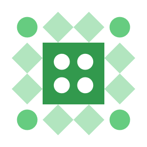
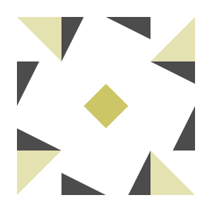
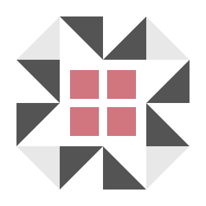

<div align="center">
   
   <br>
   
   
   
   
   
   <div align="center" style="display: flex; gap: 5px; justify-content: center;">
      
      
   </div>
   

<br>
</div>

<!---
$$\      $$\ $$$$$$$$\ $$$$$$$$\  $$$$$$\  $$\       
$$$\    $$$ |$$  _____|\__$$  __|$$  __$$\ $$ |      
$$$$\  $$$$ |$$ |         $$ |   $$ /  $$ |$$ |      
$$\$$\$$ $$ |$$$$$\       $$ |   $$$$$$$$ |$$ |      
$$ \$$$  $$ |$$  __|      $$ |   $$  __$$ |$$ |      
$$ |\$  /$$ |$$ |         $$ |   $$ |  $$ |$$ |      
$$ | \_/ $$ |$$$$$$$$\    $$ |   $$ |  $$ |$$$$$$$$\ 
\__|     \__|\________|   \__|   \__|  \__|\________
--->
# Metal


Ever been fascinated by remote gaming? Same! Inspired by the [`selkies-gstreamer`](https://github.com/selkies-project/selkies-gstreamer) project (a relic of [`Google Stadia's`](https://github.com/GoogleCloudPlatform/selkies-examples/tree/master) epicness), I decided to repack their [`egl solution`](https://github.com/selkies-project/docker-nvidia-egl-desktop) for fun - obviously. 

Introducing totally modular, Dockerized streaming service. Build it your way, whether you're on Debian or Ubuntu (I went agnostic on dependencies to keep it flexible). I revamped the structure for ultimate control, throwing in [`Supervisor`](http://supervisord.org/) magic, with a dash of [`s6-overlay`](https://github.com/just-containers/s6-overlay) structure.

Now it's a streaming powerhouse. Why? Just because!

##
<!---
#####################################################
# TL;DR
#####################################################
--->
### TL;DR 
> [!NOTE]  
> Minimal Debian image that utilizes software rendering ([llvmpipe](https://docs.mesa3d.org/drivers/llvmpipe.html])), suitable for WSL / Native linux instances.

```sh
docker run -d -p 8080:8080 -p 3478:3478/udp -p 3478:3478/tcp -p 9091:9091 -e STREAMER_HOST=$(hostname -I | awk '{print $1}') ghcr.io/utilizable/metal/minimal-debian:latest && sleep 10 && echo -e "\n\tApplication: http://$(hostname -I | awk '{print $1}'):8080" && echo -e "\tSupervisor: http://$(hostname -I | awk '{print $1}'):9091\n"
```

<!---
$$$$$$$\  $$$$$$$\  $$$$$$$$\ $$\    $$\ $$$$$$\ $$$$$$$$\ $$\      $$\ 
$$  __$$\ $$  __$$\ $$  _____|$$ |   $$ |\_$$  _|$$  _____|$$ | $\  $$ |
$$ |  $$ |$$ |  $$ |$$ |      $$ |   $$ |  $$ |  $$ |      $$ |$$$\ $$ |
$$$$$$$  |$$$$$$$  |$$$$$\    \$$\  $$  |  $$ |  $$$$$\    $$ $$ $$\$$ |
$$  ____/ $$  __$$< $$  __|    \$$\$$  /   $$ |  $$  __|   $$$$  _$$$$ |
$$ |      $$ |  $$ |$$ |        \$$$  /    $$ |  $$ |      $$$  / \$$$ |
$$ |      $$ |  $$ |$$$$$$$$\    \$  /   $$$$$$\ $$$$$$$$\ $$  /   \$$ |
\__|      \__|  \__|\________|    \_/    \______|\________|\__/     \__|
--->
## Preview
<div align="center">
<sup><code>It was easy, right?</code></sup>
<br>

</div>

<!---
$$$$$$$$\  $$$$$$\   $$$$$$\  
\__$$  __|$$  __$$\ $$  __$$\ 
   $$ |   $$ /  $$ |$$ /  \__|
   $$ |   $$ |  $$ |$$ |      
   $$ |   $$ |  $$ |$$ |      
   $$ |   $$ |  $$ |$$ |  $$\ 
   $$ |    $$$$$$  |\$$$$$$  |
   \__|    \______/  \______/
--->
## Table Of Contents:
- [Usage](#usage)
- [Setup](#setup)
- [Configuration](#configuration)
- [Development](#development)
- [Disclaimers](#disclaimers)

<!---
$$$$$$$\  $$$$$$$\  $$$$$$$$\ $$\    $$\ $$$$$$\ $$$$$$$$\ $$\      $$\ 
$$  __$$\ $$  __$$\ $$  _____|$$ |   $$ |\_$$  _|$$  _____|$$ | $\  $$ |
$$ |  $$ |$$ |  $$ |$$ |      $$ |   $$ |  $$ |  $$ |      $$ |$$$\ $$ |
$$$$$$$  |$$$$$$$  |$$$$$\    \$$\  $$  |  $$ |  $$$$$\    $$ $$ $$\$$ |
$$  ____/ $$  __$$< $$  __|    \$$\$$  /   $$ |  $$  __|   $$$$  _$$$$ |
$$ |      $$ |  $$ |$$ |        \$$$  /    $$ |  $$ |      $$$  / \$$$ |
$$ |      $$ |  $$ |$$$$$$$$\    \$  /   $$$$$$\ $$$$$$$$\ $$  /   \$$ |
\__|      \__|  \__|\________|    \_/    \______|\________|\__/     \__|
--->

<h2>Preview</h2>
<div align="center">
<sup><code>Steam? No Problem!</code></sup>
<br>

</div>

<!---
$$\   $$\  $$$$$$\   $$$$$$\   $$$$$$\  $$$$$$$$\ 
$$ |  $$ |$$  __$$\ $$  __$$\ $$  __$$\ $$  _____|
$$ |  $$ |$$ /  \__|$$ /  $$ |$$ /  \__|$$ |      
$$ |  $$ |\$$$$$$\  $$$$$$$$ |$$ |$$$$\ $$$$$\    
$$ |  $$ | \____$$\ $$  __$$ |$$ |\_$$ |$$  __|   
$$ |  $$ |$$\   $$ |$$ |  $$ |$$ |  $$ |$$ |      
\$$$$$$  |\$$$$$$  |$$ |  $$ |\$$$$$$  |$$$$$$$$\ 
 \______/  \______/ \__|  \__| \______/ \________|
--->

## Usage
<sup>[(Back to Top)](#table-of-contents)</sup><br>


This section provides guidance on deploying and configuring streaming instances using Docker, Docker Compose, and Kubernetes (K8S) manifests. It includes specific instructions for different Linux distributions and GPU acceleration.

### Table Of Contents:
  - [Usage `Docker`](./.docs/usage/USAGE.md#usage---docker) 
  - [Usage `Docker-Compose`](./.docs/usage/USAGE.md#usage---docker-compose)
  - [Usage `Kubernetes`](./.docs/usage/USAGE.md#usage---kubernetes)

<!---
$$$$$$$\  $$$$$$$\  $$$$$$$$\ $$\    $$\ $$$$$$\ $$$$$$$$\ $$\      $$\ 
$$  __$$\ $$  __$$\ $$  _____|$$ |   $$ |\_$$  _|$$  _____|$$ | $\  $$ |
$$ |  $$ |$$ |  $$ |$$ |      $$ |   $$ |  $$ |  $$ |      $$ |$$$\ $$ |
$$$$$$$  |$$$$$$$  |$$$$$\    \$$\  $$  |  $$ |  $$$$$\    $$ $$ $$\$$ |
$$  ____/ $$  __$$< $$  __|    \$$\$$  /   $$ |  $$  __|   $$$$  _$$$$ |
$$ |      $$ |  $$ |$$ |        \$$$  /    $$ |  $$ |      $$$  / \$$$ |
$$ |      $$ |  $$ |$$$$$$$$\    \$  /   $$$$$$\ $$$$$$$$\ $$  /   \$$ |
\__|      \__|  \__|\________|    \_/    \______|\________|\__/     \__|
--->

<h2>Preview</h2>
<div align="center">
<sup><code>Want to play with others?</code></sup>
<br>

</div>

<!---
 $$$$$$\  $$$$$$$$\ $$$$$$$$\ $$\   $$\ $$$$$$$\  
$$  __$$\ $$  _____|\__$$  __|$$ |  $$ |$$  __$$\ 
$$ /  \__|$$ |         $$ |   $$ |  $$ |$$ |  $$ |
\$$$$$$\  $$$$$\       $$ |   $$ |  $$ |$$$$$$$  |
 \____$$\ $$  __|      $$ |   $$ |  $$ |$$  ____/ 
$$\   $$ |$$ |         $$ |   $$ |  $$ |$$ |      
\$$$$$$  |$$$$$$$$\    $$ |   \$$$$$$  |$$ |      
 \______/ \________|   \__|    \______/ \__|      
--->

## Setup
<sup>[(Back to Top)](#table-of-contents)</sup><br>



This repository features an [Ansible Playbook](./setup/ansible) that guides you through a minimal setup, starting from the latest NVIDIA driver all the way to a fully functional Kubernetes cluster with GPU-MPS sharing capabilities. The [Ansible playbook](./setup/ansible/playbooks/playbook.yml) is self explanatory - tailored for Ubuntu and Debian distributions.

> [!TIP]
> <details>
>  <summary>Helpful Resources </summary>
>    <br>
> <ul>
>    <li><a href="https://www.reddit.com/r/devops/comments/10xty21/comparison_among_techniques_to_share_gpus_in/">Techniques to share GPU in Kubernetes</a></li>
>    <li><a href="https://docs.google.com/document/d/1H-ddA11laPQf_1olwXRjEDbzNihxprjPr74pZ4Vdf2M/edit?pli=1">MPS Support in the Kubernetes GPU Device Plugin</a></li>
>    <li><a href="https://www.declarativesystems.com/2023/11/04/kubernetes-nvidia.html">Kubernetes + NVIDIA on K3S</a></li>
>    <li><a href="https://jayground8-github-io.translate.goog/blog/20240324-k8s-device-plugin?_x_tr_sl=auto&_x_tr_tl=pl&_x_tr_hl=pl&_x_tr_hist=true">Using NVIDIA GPU Multi-Process Service with k8s-device-plugin</a></li>
>    <li><a href="https://gist.github.com/bgulla/5ea0e7fd310b5db4f9b66036d1cdb3d3">GPU Operator Snippet</a></li>
>    <li><a href="https://github.com/NVIDIA/k8s-device-plugin/tree/main/deployments/helm/nvidia-device-plugin">Nvidia Device Plugin</a></li>
>    <li><a href="https://github.com/UntouchedWagons/K3S-NVidia">K3S-NVidia</a></li>
>    <li><a href="https://docs.nvidia.com/datacenter/cloud-native/container-toolkit/latest/install-guide.html">NVIDIA Container Toolkit</a></li>
> </ul>
> </table>
> </details>

### Table Of Contents:
  - [Setup `Ansible`](./.docs/setup/SETUP.md#setup---ansible)
  - [Setup `Bash`](./.docs/setup/SETUP.md#setup---bash) ⚠️
  - [Setup `WSL`](./.docs/setup/SETUP.md#setup---wsl)
##
<!---
#####################################################
# Setup - Ansible
#####################################################
--->

### Setup - Ansible
<sup>[(Back to Setup)](#setup)</sup>
<br>
<sup>[(Back to Top)](#table-of-contents)</sup><br>

Clone this repository and run the [setup.sh](./setup/ansible/setup.sh) bash script. This will fetch all the necessary Ansible dependencies and execute the playbook.

```sh
git clone https://github.com/utilizable/metal.git && cd metal/setup/ansible && ./setup.sh
```

##
<!---
#####################################################
Setup - Bash - WIP!
#####################################################
--->

### Setup - Bash
<sup>[(Back to Setup)](#setup)</sup>
<br>
<sup>[(Back to Top)](#table-of-contents)</sup><br>

<!--- WIP --->

<!--- WIP --->

Clone this repository and run the [setup.sh](./setup/setup/bash/setup.sh) bash script. This will fetch and install all the necessary dependencies and components.

```sh
git clone https://github.com/utilizable/metal.git && cd metal/setup/bash && ./setup.sh
```

##
<!---
#####################################################
Setup - WSL
#####################################################
--->

### Setup - WSL
<sup>[(Back to Setup)](#setup)</sup>
<br>
<sup>[(Back to Top)](#table-of-contents)</sup><br>

Consider this more of a curiosity than a genuine configuration; Vulkan doesn’t function properly on WSL-Linux, which severely limits gaming options.

> [!WARNING]  
> - GPU-Sharing functionality (MPS) isn't working under WSL-Linux. ([#3024](https://github.com/canonical/microk8s/issues/3024))
> - Vulkan isn't functioning properly; only selected linux-native games are working.
> - Performance is lacking; you can only play very lightweight games.

Instructions for setting up WSL with the D3D12 renderer are provided in a separate documentation file - [WSL.md](.docs/setup/WSL.md).

<!---
 $$$$$$\   $$$$$$\  $$\   $$\ $$$$$$$$\ $$$$$$\  $$$$$$\  $$\   $$\ $$$$$$$\   $$$$$$\ $$$$$$$$\ $$$$$$\  $$$$$$\  $$\   $$\ 
$$  __$$\ $$  __$$\ $$$\  $$ |$$  _____|\_$$  _|$$  __$$\ $$ |  $$ |$$  __$$\ $$  __$$\\__$$  __|\_$$  _|$$  __$$\ $$$\  $$ |
$$ /  \__|$$ /  $$ |$$$$\ $$ |$$ |        $$ |  $$ /  \__|$$ |  $$ |$$ |  $$ |$$ /  $$ |  $$ |     $$ |  $$ /  $$ |$$$$\ $$ |
$$ |      $$ |  $$ |$$ $$\$$ |$$$$$\      $$ |  $$ |$$$$\ $$ |  $$ |$$$$$$$  |$$$$$$$$ |  $$ |     $$ |  $$ |  $$ |$$ $$\$$ |
$$ |      $$ |  $$ |$$ \$$$$ |$$  __|     $$ |  $$ |\_$$ |$$ |  $$ |$$  __$$< $$  __$$ |  $$ |     $$ |  $$ |  $$ |$$ \$$$$ |
$$ |  $$\ $$ |  $$ |$$ |\$$$ |$$ |        $$ |  $$ |  $$ |$$ |  $$ |$$ |  $$ |$$ |  $$ |  $$ |     $$ |  $$ |  $$ |$$ |\$$$ |
\$$$$$$  | $$$$$$  |$$ | \$$ |$$ |      $$$$$$\ \$$$$$$  |\$$$$$$  |$$ |  $$ |$$ |  $$ |  $$ |   $$$$$$\  $$$$$$  |$$ | \$$ |
 \______/  \______/ \__|  \__|\__|      \______| \______/  \______/ \__|  \__|\__|  \__|  \__|   \______| \______/ \__|  \__|
--->

## Configuration
<sup>[(Back to Top)](#table-of-contents)</sup><br>



This section highlights the critical configurations and components necessary for maximizing the performance and functionality of your media streaming and communication setup. Each configuration is tailored to improve the overall user experience. You can find all the configurations described below in the [Dockerfile](https://github.com/utilizable/metal/blob/develop/build/docker/Dockerfile.debbased#L1314).

### Table Of Contents:
  - [Configuration `Selkies Gstreamer`](#configuration---selkies-gstreamer)
  - [Configuration `Pipewire`](#configuration---pipewire)
  - [Configuration `Coturn`](#configuration---coturn)
  - [Configuration `Miscellaneous`](#configuration---miscellaneous)

##
<!---
#####################################################
# Configuration - Selkies-Gstreamer
#####################################################
--->

### Configuration - Selkies-Gstreamer
<sup>[(Back to Configuration)](#configuration)</sup>
<br>
<sup>[(Back to Top)](#table-of-contents)</sup><br>

Selkies-GStreamer is an open-source low-latency high-performance Linux-native GPU/CPU-accelerated WebRTC HTML5 remote desktop streaming platform. 

<details>
  <summary>Environment Variables Overview: 📍</summary>
  <br>  
  <table>
      <tr>
          <td><strong>VARIABLE</strong></td>
          <td><strong>DESCRIPTION</strong></td>
          <td><strong>DEFAULT</strong></td>
      </tr>
      <tr>
          <td>SELKIES_AUDIO_BITRATE</td>
          <td>Default audio bitrate in bits per second</td>
          <td>128000</td>
      </tr>
      <tr>
          <td>SELKIES_FRAMERATE</td>
          <td>Framerate of the streamed remote desktop</td>
          <td>60</td>
      </tr>
      <tr>
          <td>SELKIES_VIDEO_BITRATE</td>
          <td>Default video bitrate in kilobits per second</td>
          <td>2000</td>
      </tr>
      <tr>
          <td>SELKIES_ENABLE_BASIC_AUTH</td>
          <td>Enable basic authentication on server</td>
          <td>false</td>
      </tr>
      <tr>
          <td>SELKIES_ENABLE_RESIZE</td>
          <td>Enable dynamic resizing to match browser size</td>
          <td>true</td>
      </tr>
      <tr>
          <td>SELKIES_ENCODER</td>
          <td>GStreamer video encoder to use</td>
          <td>x264enc</td>
      </tr>
      <tr>
          <td>SELKIES_INTERPOSER</td>
          <td>Path to the joystick interposer plugin</td>
          <td>/usr/$LIB/selkies_joystick_interposer.so</td>
      </tr>
      <tr>
          <td>GST_DEBUG</td>
          <td>GStreamer debug level</td>
          <td>${GST_DEBUG:-*:2}</td>
      </tr>
      <tr>
          <td>GSTREAMER_PATH</td>
          <td>Path to GStreamer installation</td>
          <td>/opt/gstreamer</td>
      </tr>
      <tr>
          <td>SELKIES_ENABLE_METRICS_HTTP</td>
          <td>Enable the Prometheus HTTP metrics port</td>
          <td>true</td>
      </tr>
      <tr>
          <td>SELKIES_METRICS_HTTP_PORT</td>
          <td>Port to start the Prometheus metrics server on</td>
          <td>9090</td>
      </tr>
      <tr>
          <td>SELKIES_ADDR</td>
          <td>Host to listen to for the signaling and web server</td>
          <td>0.0.0.0</td>
      </tr>
      <tr>
          <td>SELKIES_PORT</td>
          <td>Port to listen to for the signaling and web server</td>
          <td>8080</td>
      </tr>
      <tr>
          <td>SELKIES_TURN_PORT</td>
          <td>TURN port for signaling</td>
          <td>3478</td>
      </tr>
      <tr>
          <td>SELKIES_TURN_USERNAME</td>
          <td>Username for TURN authentication</td>
          <td>user</td>
      </tr>
      <tr>
          <td>SELKIES_TURN_PASSWORD</td>
          <td>Password for TURN authentication</td>
          <td>password</td>
      </tr>
  </table>
</details>

For more information, visit [selkies-gstreamer](https://github.com/selkies-project/selkies-gstreamer) home page.

##
<!---
#####################################################
# Configuration - Pipewire
#####################################################
--->

### Configuration - Pipewire
<sup>[(Back to Configuration)](#configuration)</sup>
<br>
<sup>[(Back to Top)](#table-of-contents)</sup><br>
PipeWire is a project that aims to greatly improve handling of audio and video under Linux. 

<details>
  <summary>Environment Variables Overview: 📍</summary>
  <br>  
  <table>
      <tr>
          <td><strong>VARIABLE</strong></td>
          <td><strong>DESCRIPTION</strong></td>
          <td><strong>DEFAULT</strong></td>
      </tr>
      <tr>
          <td>DISABLE_RTKIT</td>
          <td>Disables RTKit service</td>
          <td>y</td>
      </tr>
      <tr>
          <td>PIPEWIRE_PORT</td>
          <td>Port for PipeWire audio server</td>
          <td>4713</td>
      </tr>
      <tr>
          <td>PIPEWIRE_DEBUG</td>
          <td>Debug level for PipeWire</td>
          <td>E</td>
      </tr>
      <tr>
          <td>WIREPLUMBER_DEBUG</td>
          <td>Debug level for WirePlumber</td>
          <td>E</td>
      </tr>
      <tr>
          <td>PIPEWIRE_LATENCY</td>
          <td>Latency setting for PipeWire in the format "buffer size/sample rate"</td>
          <td>32/48000</td>
      </tr>
  </table>
</details>

For more information, visit [coturn](https://github.com/coturn/coturn) home page.

##
<!---
#####################################################
# Configuration - Coturn
#####################################################
--->

### Configuration - Coturn
<sup>[(Back to Configuration)](#configuration)</sup>
<br>
<sup>[(Back to Top)](#table-of-contents)</sup><br>

Coturn is a free open source implementation of TURN and STUN Server. 
<br>

<details>
  <summary>Environment Variables Overview: 📍</summary>
  <br>  
  <table>
      <tr>
          <td><strong>VARIABLE</strong></td>
          <td><strong>DESCRIPTION</strong></td>
          <td><strong>DEFAULT</strong></td>
      </tr>
      <tr>
          <td>TURN_PORT</td>
          <td>Port for TURN server communication</td>
          <td>3478</td>
      </tr>
      <tr>
          <td>TURN_USERNAME</td>
          <td>Username for TURN server authentication</td>
          <td>user</td>
      </tr>
      <tr>
          <td>TURN_PASSWORD</td>
          <td>Password for TURN server authentication</td>
          <td>password</td>
      </tr>
      <tr>
          <td>TURN_MIN_PORT</td>
          <td>Minimum port range for TURN allocation</td>
          <td>49160</td>
      </tr>
      <tr>
          <td>TURN_MAX_PORT</td>
          <td>Maximum port range for TURN allocation</td>
          <td>49200</td>
      </tr>
      <tr>
          <td>TURN_REALM</td>
          <td>Realm used for TURN authentication</td>
          <td>local.host</td>
      </tr>
  </table>
</details>

For more information, visit [coturn](https://github.com/coturn/coturn) home page.

##
<!---
#####################################################
# Configuration - Miscellaneous
#####################################################
--->

### Configuration - Miscellaneous
<sup>[(Back to Configuration)](#configuration)</sup>
<br>
<sup>[(Back to Top)](#table-of-contents)</sup>
<br>

The Miscellaneous subsection includes various additional configurations.

<ul>
   
<!---
#####################################################
# Configuration - Miscellaneous - Graphic
#####################################################
--->  
  <li>
    <h4>Configuration - Miscellaneous - Graphic</h4>
     <details>
      <summary>Environment Variables Overview: 📍</summary>
      <br>  
      <table>
          <tr>
              <td><strong>VARIABLE</strong></td>
              <td><strong>DESCRIPTION</strong></td>
              <td><strong>DEFAULT</strong></td>
          </tr>
          <tr>
              <td>NVIDIA_VISIBLE_DEVICES</td>
              <td>Specifies which NVIDIA devices are visible to the application</td>
              <td>all</td>
          </tr>
          <tr>
              <td>NVIDIA_DRIVER_CAPABILITIES</td>
              <td>Specifies the capabilities that the NVIDIA driver should expose</td>
              <td>all</td>
          </tr>
          <tr>
              <td>LD_LIBRARY_PATH</td>
              <td>Path for the dynamic linker to find shared libraries</td>
              <td>${LD_LIBRARY_PATH:+${LD_LIBRARY_PATH}:}/usr/local/nvidia/lib:/usr/local/nvidia/lib64</td>
          </tr>
          <tr>
              <td>PATH</td>
              <td>Path to the NVIDIA binaries</td>
              <td>/usr/local/nvidia/bin${PATH:+:${PATH}}</td>
          </tr>
          <tr>
              <td>EGL_DEVICE_INDEX</td>
              <td>Index of the EGL device to use</td>
              <td>0</td>
          </tr>
          <tr>
              <td>__NV_PRIME_RENDER_OFFLOAD</td>
              <td>Enables PRIME render offload</td>
              <td>1</td>
          </tr>
          <tr>
              <td>__GL_SYNC_TO_VBLANK</td>
              <td>Synchronizes OpenGL rendering to the vertical blank</td>
              <td>0</td>
          </tr>
          <tr>
              <td>__GLX_VENDOR_LIBRARY_NAME</td>
              <td>Specifies the GLX vendor library to use</td>
              <td>mesa</td>
          </tr>
          <tr>
              <td>PRIME_RENDERER_GLOBAL</td>
              <td>Enables or disables global PRIME rendering</td>
              <td>true</td>
          </tr>
          <tr>
              <td>PRIME_RENDERER_WINE</td>
              <td>Enables or disables PRIME rendering for Wine applications</td>
              <td>true</td>
          </tr>
      </table>
    </details>
  </li>

<!---
#####################################################
# Configuration - Miscellaneous - Desktop Environment
#####################################################
--->  
  <li>
    <h4>Configuration - Miscellaneous - Desktop Environment</h4>
    <details>
      <summary>Environment Variables Overview: 📍</summary>
      <br>  
      <table>
          <tr>
              <td><strong>VARIABLE</strong></td>
              <td><strong>DESCRIPTION</strong></td>
              <td><strong>DEFAULT</strong></td>
          </tr>
          <tr>
              <td>DESKTOP_SESSION</td>
              <td>Current desktop session type</td>
              <td>plasma</td>
          </tr>
          <tr>
              <td>XDG_SESSION_DESKTOP</td>
              <td>Session desktop environment</td>
              <td>KDE</td>
          </tr>
          <tr>
              <td>XDG_CURRENT_DESKTOP</td>
              <td>The current desktop environment</td>
              <td>KDE</td>
          </tr>
          <tr>
              <td>XDG_SESSION_TYPE</td>
              <td>Type of session being run</td>
              <td>x11</td>
          </tr>
          <tr>
              <td>KDE_FULL_SESSION</td>
              <td>Indicates if the full KDE session is active</td>
              <td>true</td>
          </tr>
          <tr>
              <td>KDE_SESSION_VERSION</td>
              <td>Version of the KDE session in use</td>
              <td>5</td>
          </tr>
          <tr>
              <td>KDE_APPLICATIONS_AS_SCOPE</td>
              <td>Whether to use KDE applications as scope</td>
              <td>1</td>
          </tr>
          <tr>
              <td>KWIN_COMPOSE</td>
              <td>Enables or disables composition in KWin</td>
              <td>N</td>
          </tr>
          <tr>
              <td>KWIN_EFFECTS_FORCE_ANIMATIONS</td>
              <td>Forces animations in KWin effects</td>
              <td>0</td>
          </tr>
          <tr>
              <td>KWIN_EXPLICIT_SYNC</td>
              <td>Enables explicit synchronization for KWin</td>
              <td>0</td>
          </tr>
          <tr>
              <td>KWIN_X11_NO_SYNC_TO_VBLANK</td>
              <td>Disables synchronization to vertical blank in KWin</td>
              <td>1</td>
          </tr>
          <tr>
              <td>GTK_IM_MODULE</td>
              <td>Input method module for GTK applications</td>
              <td>fcitx</td>
          </tr>
          <tr>
              <td>QT_IM_MODULE</td>
              <td>Input method module for Qt applications</td>
              <td>fcitx</td>
          </tr>
          <tr>
              <td>XIM</td>
              <td>Input method for X11</td>
              <td>fcitx</td>
          </tr>
          <tr>
              <td>XMODIFIERS</td>
              <td>Specifies input method modifiers</td>
              <td>@im=fcitx</td>
          </tr>
      </table>
    </details>
  </li>
  
</ul>

<!---
$$$$$$$\  $$$$$$$\  $$$$$$$$\ $$\    $$\ $$$$$$\ $$$$$$$$\ $$\      $$\ 
$$  __$$\ $$  __$$\ $$  _____|$$ |   $$ |\_$$  _|$$  _____|$$ | $\  $$ |
$$ |  $$ |$$ |  $$ |$$ |      $$ |   $$ |  $$ |  $$ |      $$ |$$$\ $$ |
$$$$$$$  |$$$$$$$  |$$$$$\    \$$\  $$  |  $$ |  $$$$$\    $$ $$ $$\$$ |
$$  ____/ $$  __$$< $$  __|    \$$\$$  /   $$ |  $$  __|   $$$$  _$$$$ |
$$ |      $$ |  $$ |$$ |        \$$$  /    $$ |  $$ |      $$$  / \$$$ |
$$ |      $$ |  $$ |$$$$$$$$\    \$  /   $$$$$$\ $$$$$$$$\ $$  /   \$$ |
\__|      \__|  \__|\________|    \_/    \______|\________|\__/     \__|
--->
<h2>Preview</h2>
<div align="center">
<sup><code>Play anywhere!</code></sup>
<br>
   
<br>
</div>

<!---
$$$$$$$\  $$$$$$$$\ $$\    $$\ $$$$$$$$\ $$\       $$$$$$\  $$$$$$$\  $$\      $$\ $$$$$$$$\ $$\   $$\ $$$$$$$$\ 
$$  __$$\ $$  _____|$$ |   $$ |$$  _____|$$ |     $$  __$$\ $$  __$$\ $$$\    $$$ |$$  _____|$$$\  $$ |\__$$  __|
$$ |  $$ |$$ |      $$ |   $$ |$$ |      $$ |     $$ /  $$ |$$ |  $$ |$$$$\  $$$$ |$$ |      $$$$\ $$ |   $$ |   
$$ |  $$ |$$$$$\    \$$\  $$  |$$$$$\    $$ |     $$ |  $$ |$$$$$$$  |$$\$$\$$ $$ |$$$$$\    $$ $$\$$ |   $$ |   
$$ |  $$ |$$  __|    \$$\$$  / $$  __|   $$ |     $$ |  $$ |$$  ____/ $$ \$$$  $$ |$$  __|   $$ \$$$$ |   $$ |   
$$ |  $$ |$$ |        \$$$  /  $$ |      $$ |     $$ |  $$ |$$ |      $$ |\$  /$$ |$$ |      $$ |\$$$ |   $$ |   
$$$$$$$  |$$$$$$$$\    \$  /   $$$$$$$$\ $$$$$$$$\ $$$$$$  |$$ |      $$ | \_/ $$ |$$$$$$$$\ $$ | \$$ |   $$ |   
\_______/ \________|    \_/    \________|\________|\______/ \__|      \__|     \__|\________|\__|  \__|   \__|
 --->
## Development
<sup>[(Back to top)](#table-of-contents)</sup>



I created this section primarily for myself to organize my future work, helping me quickly recall where I left off and where I can start.
Here, I will provide a full description of the Dockerfile, the repository structure, and my future plans.

### Table Of Contents:
  - [Development - Structure](#development---structure)
     - [Development - Structure - Monolith](#development---structure---monolith)
     - [Development - Structure - Microservices](#development---structure---microservices) ⚠️
     - [Development - Structure - Repository](#development---structure---repository)
  - [Development - Workflow - CICD](#development---workflow---cicd)
     - [Development - Workflow - CI](#development---workflow---ci)
     - [Development - Workflow - CD](#development---workflow---cd) ⚠️
  - [Development - Futher-Works](./docs/development/FUTHER_WORKS.md)

##
<!---
#####################################################
# Development - Structure
#####################################################
--->  
### Development - Structure 

<!---
#####################################################
# Development - Structure - Monolith
#####################################################
--->  
#### Development - Structure - Monolith 
<sup>[(Back to Development)](#development)</sup>
<br>
<sup>[(Back to Top)](#table-of-contents)</sup>
<br>

The Dockerfile encompasses all the essential components required for a seamless gaming experience, with management and orchestration handled by Supervisor.

<details>
   <summary>Core components: 📍</summary>
   <br>  
   <table>
      <tr align="center">
          <td><strong>Orchiestrator</strong></td>
          <td><strong>Component</strong></td>
          <td><strong>Description</strong></td>
          <td><strong>Purpose</strong></td>
      </tr>
      <tr>
         <td rowspan="7"><sup>Supervisord</sup></td>
      </tr>
      <tr>
          <td><sup>Kde-Plasma</sup></td>
          <td><sup>Desktop Environment</sup></td>
          <td><sup>Provides a graphical interface for user interaction</sup></td>
      </tr> 
      <tr>
          <td><sup>D-Bus</sup></td>
          <td><sup>Message bus system</sup></td>
          <td><sup>Facilitates communication between processes</sup></td>
      </tr> 
      <tr>
          <td><sup>PipeWire</sup></td>
          <td><sup>Multimedia server</sup></td>
          <td><sup>Handles audio and video streams</sup></td>
      </tr> 
      <tr>
          <td><sup>Selkies-Gstreamer</sup></td>
          <td><sup>Media processing framework</sup></td>
          <td><sup>Rremote desktop streaming platform</sup></td>
      </tr>   
      <tr>
          <td><sup>xvfb</sup></td>
          <td><sup>X virtual framebuffer</sup></td>
          <td><sup>Provides a display server for graphical applications</sup></td>
      </tr>
      <tr>
          <td><sup>Coturn</sup></td>
          <td><sup>TURN and STUN server</sup></td>
          <td><sup>Provides NAT traversal for WebRTC</sup></td>
      </tr>
   </table>
</details>
      
The complete image also includes additional features, such as a fully configured Steam client, Heroic Launcher, and VirtualGL.

<details>
   <summary>Additonal components: 📍</summary>
   <br>  
   <table>
       <tr>
           <td><strong>Component</strong></td>
           <td><strong>Description</strong></td>
           <td><strong>Purpose</strong></td>
       </tr>
       <tr>
           <td><sup>VirtualGL</sup></td>
           <td><sup>Open-source software</sup></td>
           <td><sup>Enables OpenGL applications to run on a remote server</sup></td>
       </tr>
       <tr>
           <td><sup>Wine</sup></td>
           <td><sup>Compatibility layer</sup></td>
           <td><sup>Allows Windows applications to run on Linux</sup></td>
       </tr>
       <tr>
           <td><sup>Lutris</sup></td>
           <td><sup>Gaming platform</sup></td>
           <td><sup>Manages and launches games from various sources</sup></td>
       </tr>
       <tr>
           <td><sup>Steam</sup></td>
           <td><sup>Digital distribution platform</sup></td>
           <td><sup>Offers games and software for purchase and download</sup></td>
       </tr>
       <tr>
           <td><sup>Heroic Launcher</sup></td>
           <td><sup>Game launcher</sup></td>
           <td><sup>Manages and launches games from the Epic Games Store</sup></td>
       </tr>
       <tr>
           <td><sup>WirePlumber</sup></td>
           <td><sup>Session manager</sup></td>
           <td><sup>Manages PipeWire sessions and connections</sup></td>
       </tr>
       <tr>
           <td><sup>Firefox-Nightly</sup></td>
           <td><sup>Web browser</sup></td>
           <td><sup>Provides a testing version of the Firefox browser with the latest features</sup></td>
       </tr>
   </table>
</details>

##

<div align="center">
<sup><code>What is this, Granny? Some outdated sysadmin techniques?</code></sup>
<br>   
  
</div>

##

Each additional component has its own arguments to include during the build process, also you can choose the appropriate version of each component.

> [!NOTE]
> Each `RUN` block in the Dockerfile is independent — it doesn't rely on any other RUN blocks, allowing you to rearrange them as needed.

##

<div align="center">
<sup><code>Build Arguments? Who's using those? Come on, bro!</code></sup>
<br>      
  
</div>

##
<!---
#####################################################
# Development - Structure - Microservices
#####################################################
--->  
####  Development - Structure - Microservices
<sup>[(Back to Development)](#development)</sup>
<br>
<sup>[(Back to Top)](#table-of-contents)</sup>
<br>


Lorem ipsum dolor sit amet, consectetur adipiscing elit. Phasellus sit amet neque non dui luctus posuere. Phasellus laoreet elit eu diam ultrices fermentum. Ut posuere, quam sed blandit ornare, lacus nisi consectetur tortor, vel dictum erat enim a leo. Curabitur dictum tristique hendrerit.

##

<div align="center">
<sup><code>Finaly! Something intresting.</code></sup>
<br>   
  
</div>

##
<!---
#####################################################
# Development - Structure - Repository
#####################################################
--->  
#### Development - Structure - Repository
<sup>[(Back to Development)](#development)</sup>
<br>
<sup>[(Back to Top)](#table-of-contents)</sup>
<br>


##
<!---
#####################################################
# Development - Workflow CICD
#####################################################
--->  
### Development - Workflow CICD
<!---
#####################################################
# Development - Workflow CICD
#####################################################
--->  
#### Development - Workflow CI
<sup>[(Back to Development)](#development)</sup>
<br>
<sup>[(Back to Top)](#table-of-contents)</sup>
<br>

##

#### Development - Workflow CD
<sup>[(Back to Development)](#development)</sup>
<br>
<sup>[(Back to Top)](#table-of-contents)</sup>
<br>


<!---
$$$$$$$\  $$$$$$\  $$$$$$\   $$$$$$\  $$\        $$$$$$\  $$$$$$\ $$\      $$\ $$$$$$$$\ $$$$$$$\   $$$$$$\  
$$  __$$\ \_$$  _|$$  __$$\ $$  __$$\ $$ |      $$  __$$\ \_$$  _|$$$\    $$$ |$$  _____|$$  __$$\ $$  __$$\ 
$$ |  $$ |  $$ |  $$ /  \__|$$ /  \__|$$ |      $$ /  $$ |  $$ |  $$$$\  $$$$ |$$ |      $$ |  $$ |$$ /  \__|
$$ |  $$ |  $$ |  \$$$$$$\  $$ |      $$ |      $$$$$$$$ |  $$ |  $$\$$\$$ $$ |$$$$$\    $$$$$$$  |\$$$$$$\  
$$ |  $$ |  $$ |   \____$$\ $$ |      $$ |      $$  __$$ |  $$ |  $$ \$$$  $$ |$$  __|   $$  __$$<  \____$$\ 
$$ |  $$ |  $$ |  $$\   $$ |$$ |  $$\ $$ |      $$ |  $$ |  $$ |  $$ |\$  /$$ |$$ |      $$ |  $$ |$$\   $$ |
$$$$$$$  |$$$$$$\ \$$$$$$  |\$$$$$$  |$$$$$$$$\ $$ |  $$ |$$$$$$\ $$ | \_/ $$ |$$$$$$$$\ $$ |  $$ |\$$$$$$  |
\_______/ \______| \______/  \______/ \________|\__|  \__|\______|\__|     \__|\________|\__|  \__| \______/
--->

## Disclaimers
<sup>[(Back to top)](#table-of-contents)</sup>


This section contains important disclaimers regarding the ownership of software and the funding sources for the project. Please review the details carefully to understand the rights associated with the software and the contributions of supporting organizations.

<br>

<ul>
  
  <details>
  <summary>Copyright</summary>
  <br>
    I hereby declare that I do not claim any rights to the software used in this repository. 
    All software, including any components, libraries, and dependencies, belongs to their original creators.
    All copyright and other intellectual property rights associated with this software remain with their respective owners. 
    This statement is intended to clarify that I do not assert any rights to the intellectual property or any part of this software.
    It is recommended to review the licensing terms of each used component before using or modifying them.
  </details> 
  
  <details>
  <summary>Selkies-Gstreamer</summary>
  <br>
    This project has been developed and is supported in part by the National Research Platform (NRP) and the Cognitive Hardware and Software Ecosystem Community Infrastructure (CHASE-CI) at the University of California, San Diego, by funding from the National Science Foundation (NSF), with awards #1730158, #1540112, #1541349, #1826967, #2138811, #2112167, #2100237, and #2120019, as well as additional funding from community partners, infrastructure utilization from the Open Science Grid Consortium, supported by the National Science Foundation (NSF) awards #1836650 and #2030508, and infrastructure utilization from the Chameleon testbed, supported by the National Science Foundation (NSF) awards #1419152, #1743354, and #2027170. This project has also been funded by the Seok-San Yonsei Medical Scientist Training Program (MSTP) Song Yong-Sang Scholarship, College of Medicine, Yonsei University, the MD-PhD/Medical Scientist Training Program (MSTP) through the Korea Health Industry Development Institute (KHIDI), funded by the Ministry of Health & Welfare, Republic of Korea, and the Student Research Bursary of Song-dang Institute for Cancer Research, College of Medicine, Yonsei University.
  </details> 
  
</ul>

##

<div align="center">
   
</div>
