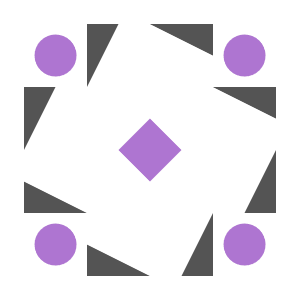

<div align="center">
   <div style="width: 100%; height: auto; background-color: black;">
            
   </div>

   <br>
   
   
   
   
   
   <div align="center" style="display: flex; gap: 5px; justify-content: center;">
      
      
   </div>
   
</div>

<!---
$$\      $$\ $$$$$$$$\ $$$$$$$$\  $$$$$$\  $$\       
$$$\    $$$ |$$  _____|\__$$  __|$$  __$$\ $$ |      
$$$$\  $$$$ |$$ |         $$ |   $$ /  $$ |$$ |      
$$\$$\$$ $$ |$$$$$\       $$ |   $$$$$$$$ |$$ |      
$$ \$$$  $$ |$$  __|      $$ |   $$  __$$ |$$ |      
$$ |\$  /$$ |$$ |         $$ |   $$ |  $$ |$$ |      
$$ | \_/ $$ |$$$$$$$$\    $$ |   $$ |  $$ |$$$$$$$$\ 
\__|     \__|\________|   \__|   \__|  \__|\________
--->
# Metal


Ever been fascinated by remote gaming? Same! Inspired by the [`selkies-gstreamer`](https://github.com/selkies-project/selkies-gstreamer) project (a relic of [`Google Stadia's`](https://github.com/GoogleCloudPlatform/selkies-examples/tree/master) epicness), I decided to repack their [`egl solution`](https://github.com/selkies-project/docker-nvidia-egl-desktop) for fun - obviously. 

Introducing totally modular, Dockerized streaming service. Build it your way, whether you're on Debian or Ubuntu (I went agnostic on dependencies to keep it flexible). I revamped the structure for ultimate control, throwing in [`Supervisor`](http://supervisord.org/) magic, with a dash of [`s6-overlay`](https://github.com/just-containers/s6-overlay) structure.

Now it's a streaming powerhouse. Why? Just because!

##
<!---
#####################################################
# TL;DR
#####################################################
--->
### TL;DR 
> [!NOTE]  
> Minimal Debian image that utilizes software rendering ([llvmpipe](https://docs.mesa3d.org/drivers/llvmpipe.html])), suitable for WSL / Native linux instances.

```sh
docker run -d -p 8080:8080 -p 3478:3478/udp -p 3478:3478/tcp -p 9091:9091 -e STREAMER_HOST=$(hostname -I | awk '{print $1}') ghcr.io/utilizable/metal/minimal-debian:latest && sleep 10 && echo -e "\n\tApplication: http://$(hostname -I | awk '{print $1}'):8080" && echo -e "\tSupervisor: http://$(hostname -I | awk '{print $1}'):9091\n"
```

<!---
$$$$$$$\  $$$$$$$\  $$$$$$$$\ $$\    $$\ $$$$$$\ $$$$$$$$\ $$\      $$\ 
$$  __$$\ $$  __$$\ $$  _____|$$ |   $$ |\_$$  _|$$  _____|$$ | $\  $$ |
$$ |  $$ |$$ |  $$ |$$ |      $$ |   $$ |  $$ |  $$ |      $$ |$$$\ $$ |
$$$$$$$  |$$$$$$$  |$$$$$\    \$$\  $$  |  $$ |  $$$$$\    $$ $$ $$\$$ |
$$  ____/ $$  __$$< $$  __|    \$$\$$  /   $$ |  $$  __|   $$$$  _$$$$ |
$$ |      $$ |  $$ |$$ |        \$$$  /    $$ |  $$ |      $$$  / \$$$ |
$$ |      $$ |  $$ |$$$$$$$$\    \$  /   $$$$$$\ $$$$$$$$\ $$  /   \$$ |
\__|      \__|  \__|\________|    \_/    \______|\________|\__/     \__|
--->
## Preview
<div align="center">
   <sup><code>It was easy, right?</code></sup>
   <br>
   <div style="width: 800; height: 450; background-color: black;">
         
   </div>   
</div>

<!---
$$$$$$$$\  $$$$$$\   $$$$$$\  
\__$$  __|$$  __$$\ $$  __$$\ 
   $$ |   $$ /  $$ |$$ /  \__|
   $$ |   $$ |  $$ |$$ |      
   $$ |   $$ |  $$ |$$ |      
   $$ |   $$ |  $$ |$$ |  $$\ 
   $$ |    $$$$$$  |\$$$$$$  |
   \__|    \______/  \______/
--->
## Table Of Contents:
- [Usage](#usage)
- [Setup](#setup)
- [Configuration](#configuration)
- [Development](#development)
- [Miscellaneous](#miscellaneous)
- [Disclaimers](#disclaimers)

<!---
$$\   $$\  $$$$$$\   $$$$$$\   $$$$$$\  $$$$$$$$\ 
$$ |  $$ |$$  __$$\ $$  __$$\ $$  __$$\ $$  _____|
$$ |  $$ |$$ /  \__|$$ /  $$ |$$ /  \__|$$ |      
$$ |  $$ |\$$$$$$\  $$$$$$$$ |$$ |$$$$\ $$$$$\    
$$ |  $$ | \____$$\ $$  __$$ |$$ |\_$$ |$$  __|   
$$ |  $$ |$$\   $$ |$$ |  $$ |$$ |  $$ |$$ |      
\$$$$$$  |\$$$$$$  |$$ |  $$ |\$$$$$$  |$$$$$$$$\ 
 \______/  \______/ \__|  \__| \______/ \________|
--->

## Usage
<sup>[(Back to Top)](#table-of-contents)</sup><br>


This section provides guidance on deploying and configuring streaming instances using Docker, Docker Compose, and Kubernetes (K8S) manifests. It includes specific instructions for different Linux distributions and GPU acceleration.


### Table Of Contents:
  - [Usage `Docker`](./.docs/10_usage/USAGE.md#usage---docker) 
  - [Usage `Docker-Compose`](./.docs/10_usage/USAGE.md#usage---docker-compose)
  - [Usage `Kubernetes`](./.docs/10_usage/USAGE.md#usage---kubernetes)
<sup></sup>
  - [Usage `Helm`](./.docs/10_usage/USAGE.md#usage---helm)
<sup></sup>

<!---
$$$$$$$\  $$$$$$$\  $$$$$$$$\ $$\    $$\ $$$$$$\ $$$$$$$$\ $$\      $$\ 
$$  __$$\ $$  __$$\ $$  _____|$$ |   $$ |\_$$  _|$$  _____|$$ | $\  $$ |
$$ |  $$ |$$ |  $$ |$$ |      $$ |   $$ |  $$ |  $$ |      $$ |$$$\ $$ |
$$$$$$$  |$$$$$$$  |$$$$$\    \$$\  $$  |  $$ |  $$$$$\    $$ $$ $$\$$ |
$$  ____/ $$  __$$< $$  __|    \$$\$$  /   $$ |  $$  __|   $$$$  _$$$$ |
$$ |      $$ |  $$ |$$ |        \$$$  /    $$ |  $$ |      $$$  / \$$$ |
$$ |      $$ |  $$ |$$$$$$$$\    \$  /   $$$$$$\ $$$$$$$$\ $$  /   \$$ |
\__|      \__|  \__|\________|    \_/    \______|\________|\__/     \__|
--->

<h2>Preview</h2>
<div align="center">
   <sup><code>Want to play with others?</code></sup>
   <br>
   <div style="width: 800; height: 450; background-color: black;">
      
   </div>      
</div>

<!---
 $$$$$$\  $$$$$$$$\ $$$$$$$$\ $$\   $$\ $$$$$$$\  
$$  __$$\ $$  _____|\__$$  __|$$ |  $$ |$$  __$$\ 
$$ /  \__|$$ |         $$ |   $$ |  $$ |$$ |  $$ |
\$$$$$$\  $$$$$\       $$ |   $$ |  $$ |$$$$$$$  |
 \____$$\ $$  __|      $$ |   $$ |  $$ |$$  ____/ 
$$\   $$ |$$ |         $$ |   $$ |  $$ |$$ |      
\$$$$$$  |$$$$$$$$\    $$ |   \$$$$$$  |$$ |      
 \______/ \________|   \__|    \______/ \__|      
--->

## Setup
<sup>[(Back to Top)](#table-of-contents)</sup><br>


This repository features an [Ansible Playbook](./setup/ansible) that guides you through a minimal setup, starting from the latest NVIDIA driver all the way to a fully functional Kubernetes cluster with GPU-MPS sharing capabilities. The [Ansible playbook](./setup/ansible/playbooks/playbook.yml) is self explanatory - tailored for Ubuntu and Debian distributions.


### Table Of Contents:
  - [Setup `Ansible`](./.docs/20_setup/SETUP.md#setup---ansible)
  - [Setup `Bash`](./.docs/20_setup/SETUP.md#setup---bash)
<sup></sup>
  - [Setup `WSL`](./.docs/20_setup/SETUP.md#setup---wsl)

<!---
$$$$$$$\  $$$$$$$\  $$$$$$$$\ $$\    $$\ $$$$$$\ $$$$$$$$\ $$\      $$\ 
$$  __$$\ $$  __$$\ $$  _____|$$ |   $$ |\_$$  _|$$  _____|$$ | $\  $$ |
$$ |  $$ |$$ |  $$ |$$ |      $$ |   $$ |  $$ |  $$ |      $$ |$$$\ $$ |
$$$$$$$  |$$$$$$$  |$$$$$\    \$$\  $$  |  $$ |  $$$$$\    $$ $$ $$\$$ |
$$  ____/ $$  __$$< $$  __|    \$$\$$  /   $$ |  $$  __|   $$$$  _$$$$ |
$$ |      $$ |  $$ |$$ |        \$$$  /    $$ |  $$ |      $$$  / \$$$ |
$$ |      $$ |  $$ |$$$$$$$$\    \$  /   $$$$$$\ $$$$$$$$\ $$  /   \$$ |
\__|      \__|  \__|\________|    \_/    \______|\________|\__/     \__|
--->
<h2>Preview</h2>
<div align="center">
   <sup><code>It was easy, right?</code></sup>
   <br>
   <div style="width: 800; height: 450; background-color: black;">
      
   </div>   
</div>

<!---
 $$$$$$\   $$$$$$\  $$\   $$\ $$$$$$$$\ $$$$$$\  $$$$$$\  $$\   $$\ $$$$$$$\   $$$$$$\ $$$$$$$$\ $$$$$$\  $$$$$$\  $$\   $$\ 
$$  __$$\ $$  __$$\ $$$\  $$ |$$  _____|\_$$  _|$$  __$$\ $$ |  $$ |$$  __$$\ $$  __$$\\__$$  __|\_$$  _|$$  __$$\ $$$\  $$ |
$$ /  \__|$$ /  $$ |$$$$\ $$ |$$ |        $$ |  $$ /  \__|$$ |  $$ |$$ |  $$ |$$ /  $$ |  $$ |     $$ |  $$ /  $$ |$$$$\ $$ |
$$ |      $$ |  $$ |$$ $$\$$ |$$$$$\      $$ |  $$ |$$$$\ $$ |  $$ |$$$$$$$  |$$$$$$$$ |  $$ |     $$ |  $$ |  $$ |$$ $$\$$ |
$$ |      $$ |  $$ |$$ \$$$$ |$$  __|     $$ |  $$ |\_$$ |$$ |  $$ |$$  __$$< $$  __$$ |  $$ |     $$ |  $$ |  $$ |$$ \$$$$ |
$$ |  $$\ $$ |  $$ |$$ |\$$$ |$$ |        $$ |  $$ |  $$ |$$ |  $$ |$$ |  $$ |$$ |  $$ |  $$ |     $$ |  $$ |  $$ |$$ |\$$$ |
\$$$$$$  | $$$$$$  |$$ | \$$ |$$ |      $$$$$$\ \$$$$$$  |\$$$$$$  |$$ |  $$ |$$ |  $$ |  $$ |   $$$$$$\  $$$$$$  |$$ | \$$ |
 \______/  \______/ \__|  \__|\__|      \______| \______/  \______/ \__|  \__|\__|  \__|  \__|   \______| \______/ \__|  \__|
--->

## Configuration
<sup>[(Back to Top)](#table-of-contents)</sup><br>


This section highlights the critical configurations and components necessary for maximizing the performance and functionality of your media streaming and communication setup. Each configuration is tailored to improve the overall user experience. You can find all the configurations described below in the [Dockerfile](https://github.com/utilizable/metal/blob/develop/build/docker/Dockerfile.debbased#L1314).

### Table Of Contents:
  - Configuration - Monolithc:
     - [Configuration - Monolithc - `Selkies Gstreamer`](./.docs/30_configuration/MONOLITHIC.md#configuration---monolithic---selkies-gstreamer)
     - [Configuration - Monolithc - `Pipewire`](./.docs/30_configuration/MONOLITHIC.md#configuration---monolithic---pipewire)
     - [Configuration - Monolithc - `Coturn`](./.docs/30_configuration/MONOLITHIC.md#configuration---monolithic---coturn)
     - [Configuration - Monolithc - `Miscellaneous`](./.docs/30_configuration/MONOLITHIC.md#configuration---monolithic---miscellaneous)
     - [Configuration - Monolithc - `Graphic`](./.docs/30_configuration/MONOLITHIC.md#configuration---monolithic---graphic)
     - [Configuration - Monolithc - `Desktop`](./.docs/30_configuration/MONOLITHIC.md#configuration---monolithic---desktop)

<!---
$$$$$$$\  $$$$$$$\  $$$$$$$$\ $$\    $$\ $$$$$$\ $$$$$$$$\ $$\      $$\ 
$$  __$$\ $$  __$$\ $$  _____|$$ |   $$ |\_$$  _|$$  _____|$$ | $\  $$ |
$$ |  $$ |$$ |  $$ |$$ |      $$ |   $$ |  $$ |  $$ |      $$ |$$$\ $$ |
$$$$$$$  |$$$$$$$  |$$$$$\    \$$\  $$  |  $$ |  $$$$$\    $$ $$ $$\$$ |
$$  ____/ $$  __$$< $$  __|    \$$\$$  /   $$ |  $$  __|   $$$$  _$$$$ |
$$ |      $$ |  $$ |$$ |        \$$$  /    $$ |  $$ |      $$$  / \$$$ |
$$ |      $$ |  $$ |$$$$$$$$\    \$  /   $$$$$$\ $$$$$$$$\ $$  /   \$$ |
\__|      \__|  \__|\________|    \_/    \______|\________|\__/     \__|
--->

<h2>Preview</h2>
<div align="center">
<sup><code>Steam? No Problem!</code></sup>
<br>
<kbd></kbd>
</div>

<!---
$$$$$$$\  $$$$$$$$\ $$\    $$\ $$$$$$$$\ $$\       $$$$$$\  $$$$$$$\  $$\      $$\ $$$$$$$$\ $$\   $$\ $$$$$$$$\ 
$$  __$$\ $$  _____|$$ |   $$ |$$  _____|$$ |     $$  __$$\ $$  __$$\ $$$\    $$$ |$$  _____|$$$\  $$ |\__$$  __|
$$ |  $$ |$$ |      $$ |   $$ |$$ |      $$ |     $$ /  $$ |$$ |  $$ |$$$$\  $$$$ |$$ |      $$$$\ $$ |   $$ |   
$$ |  $$ |$$$$$\    \$$\  $$  |$$$$$\    $$ |     $$ |  $$ |$$$$$$$  |$$\$$\$$ $$ |$$$$$\    $$ $$\$$ |   $$ |   
$$ |  $$ |$$  __|    \$$\$$  / $$  __|   $$ |     $$ |  $$ |$$  ____/ $$ \$$$  $$ |$$  __|   $$ \$$$$ |   $$ |   
$$ |  $$ |$$ |        \$$$  /  $$ |      $$ |     $$ |  $$ |$$ |      $$ |\$  /$$ |$$ |      $$ |\$$$ |   $$ |   
$$$$$$$  |$$$$$$$$\    \$  /   $$$$$$$$\ $$$$$$$$\ $$$$$$  |$$ |      $$ | \_/ $$ |$$$$$$$$\ $$ | \$$ |   $$ |   
\_______/ \________|    \_/    \________|\________|\______/ \__|      \__|     \__|\________|\__|  \__|   \__|
 --->
## Development
<sup>[(Back to top)](#table-of-contents)</sup>


This section explains how we build our software, focusing on different structures like monolithic and distributed systems. You will also find information about our development workflows, including continuous integration and delivery.


### Table Of Contents:
  - Development - Structure
     - [Development - Structure - Monolithic](./.docs/40_development/structure/MONOLITHIC.md#development---structure---monolithic)
   <sup></sup>
     - [Development - Structure - Distributed](./.docs/40_development/structure/DISTRIBUTED.md#development---structure---distributed)
   <sup></sup>
     - [Development - Structure - Repository](./.docs/40_development/structure/REPOSITORY.md#development---structure---repository)
   <sup></sup>
  - Development - Workflow
     - [Development - Workflow - CI](./.docs/40_development/workflow/CI.md#development---workflow---ci)
   <sup></sup>
     - [Development - Workflow - CD](./.docs/40_development/workflow/CD.md#development---workflow---cd)
   <sup></sup>


<!---
$$\      $$\ $$$$$$\  $$$$$$\   $$$$$$\  
$$$\    $$$ |\_$$  _|$$  __$$\ $$  __$$\ 
$$$$\  $$$$ |  $$ |  $$ /  \__|$$ /  \__|
$$\$$\$$ $$ |  $$ |  \$$$$$$\  $$ |      
$$ \$$$  $$ |  $$ |   \____$$\ $$ |      
$$ |\$  /$$ |  $$ |  $$\   $$ |$$ |  $$\ 
$$ | \_/ $$ |$$$$$$\ \$$$$$$  |\$$$$$$  |
\__|     \__|\______| \______/  \______/
--->
## Miscellaneous
<sup>[(Back to top)](#table-of-contents)</sup>


The "Miscellaneous" section serves as a catch-all category for content that doesn't neatly fit into other more specific categories. 

<br>

### Table Of Contents:
- Helpful Resources
   - [Helpful Resources - Setup](./.docs/50_miscellaneous/MISCELLANEOUS.md#helpful-resources---setup)
   - [Helpful Resources - Questions / Answers](./.docs/50_miscellaneous/MISCELLANEOUS.md#helpful-resources---questions---answers)
- [Document Template](./.docs/_misc/DOCUMENT_TEMPLATE.md)

<!---
$$$$$$$\  $$$$$$\  $$$$$$\   $$$$$$\  $$\        $$$$$$\  $$$$$$\ $$\      $$\ $$$$$$$$\ $$$$$$$\   $$$$$$\  
$$  __$$\ \_$$  _|$$  __$$\ $$  __$$\ $$ |      $$  __$$\ \_$$  _|$$$\    $$$ |$$  _____|$$  __$$\ $$  __$$\ 
$$ |  $$ |  $$ |  $$ /  \__|$$ /  \__|$$ |      $$ /  $$ |  $$ |  $$$$\  $$$$ |$$ |      $$ |  $$ |$$ /  \__|
$$ |  $$ |  $$ |  \$$$$$$\  $$ |      $$ |      $$$$$$$$ |  $$ |  $$\$$\$$ $$ |$$$$$\    $$$$$$$  |\$$$$$$\  
$$ |  $$ |  $$ |   \____$$\ $$ |      $$ |      $$  __$$ |  $$ |  $$ \$$$  $$ |$$  __|   $$  __$$<  \____$$\ 
$$ |  $$ |  $$ |  $$\   $$ |$$ |  $$\ $$ |      $$ |  $$ |  $$ |  $$ |\$  /$$ |$$ |      $$ |  $$ |$$\   $$ |
$$$$$$$  |$$$$$$\ \$$$$$$  |\$$$$$$  |$$$$$$$$\ $$ |  $$ |$$$$$$\ $$ | \_/ $$ |$$$$$$$$\ $$ |  $$ |\$$$$$$  |
\_______/ \______| \______/  \______/ \________|\__|  \__|\______|\__|     \__|\________|\__|  \__| \______/
--->
## Disclaimers
<sup>[(Back to top)](#table-of-contents)</sup>



This section contains important disclaimers regarding the ownership of software and the funding sources for the project. Please review the details carefully to understand the rights associated with the software and the contributions of supporting organizations.

#### Disclaimers:
<ul>
  <details>
  <summary>Copyright</summary>
  <br>
    I hereby declare that I do not claim any rights to the software used in this repository. 
    All software, including any components, libraries, and dependencies, belongs to their original creators.
    All copyright and other intellectual property rights associated with this software remain with their respective owners. 
    This statement is intended to clarify that I do not assert any rights to the intellectual property or any part of this software.
    It is recommended to review the licensing terms of each used component before using or modifying them.
  </details> 
  
  <details>
  <summary>Selkies-Gstreamer</summary>
  <br>
    This project has been developed and is supported in part by the National Research Platform (NRP) and the Cognitive Hardware and Software Ecosystem Community Infrastructure (CHASE-CI) at the University of California, San Diego, by funding from the National Science Foundation (NSF), with awards #1730158, #1540112, #1541349, #1826967, #2138811, #2112167, #2100237, and #2120019, as well as additional funding from community partners, infrastructure utilization from the Open Science Grid Consortium, supported by the National Science Foundation (NSF) awards #1836650 and #2030508, and infrastructure utilization from the Chameleon testbed, supported by the National Science Foundation (NSF) awards #1419152, #1743354, and #2027170. This project has also been funded by the Seok-San Yonsei Medical Scientist Training Program (MSTP) Song Yong-Sang Scholarship, College of Medicine, Yonsei University, the MD-PhD/Medical Scientist Training Program (MSTP) through the Korea Health Industry Development Institute (KHIDI), funded by the Ministry of Health & Welfare, Republic of Korea, and the Student Research Bursary of Song-dang Institute for Cancer Research, College of Medicine, Yonsei University.
  </details> 
  
</ul>

##

<div align="center">
   
</div>
