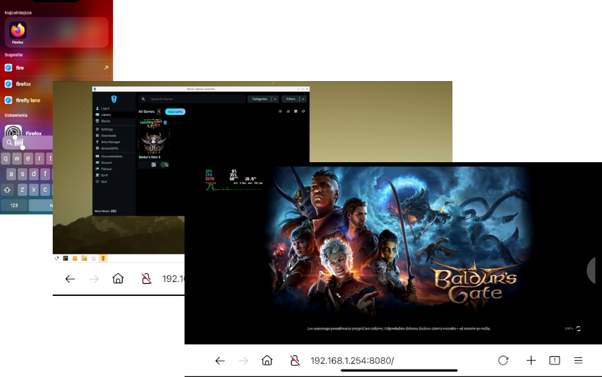
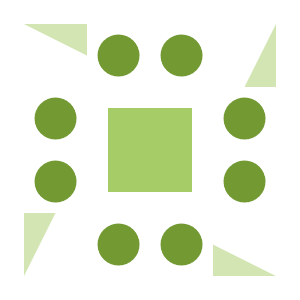

> [!NOTE]  
> - Low-Latency streaming service.
> - Game everywhere.
> - Docker is new gaming platform.

<!---
$$\      $$\ $$$$$$$$\ $$$$$$$$\  $$$$$$\  $$\       
$$$\    $$$ |$$  _____|\__$$  __|$$  __$$\ $$ |      
$$$$\  $$$$ |$$ |         $$ |   $$ /  $$ |$$ |      
$$\$$\$$ $$ |$$$$$\       $$ |   $$$$$$$$ |$$ |      
$$ \$$$  $$ |$$  __|      $$ |   $$  __$$ |$$ |      
$$ |\$  /$$ |$$ |         $$ |   $$ |  $$ |$$ |      
$$ | \_/ $$ |$$$$$$$$\    $$ |   $$ |  $$ |$$$$$$$$\ 
\__|     \__|\________|   \__|   \__|  \__|\________
--->

# Metal


Ever been fascinated by remote gaming? Same! Inspired by the [`selkies-gstreamer`](https://github.com/selkies-project/selkies-gstreamer) project (a relic of [`Google Stadia's`](https://github.com/GoogleCloudPlatform/selkies-examples/tree/master) epicness), I decided to repack their [`egl solution`](https://github.com/selkies-project/docker-nvidia-egl-desktop) for fun - obviously. My main goal was to create a product that serves as a foundation for exploring Kubernetes and containerization.

Introducing my totally modular, Dockerized streaming service. Build it your way, whether you're on Debian or Ubuntu (I went agnostic on dependencies to keep it flexible). I revamped the structure for ultimate control, throwing in Supervisord magic, with a dash of [`s6-overlay`](https://github.com/just-containers/s6-overlay) and some [`docker-steam-headless`](https://github.com/Steam-Headless/docker-steam-headless) trickery.

Now it's a streaming powerhouse. Why? Just because!

##
<!---
#####################################################
# TLDR
#####################################################
--->

### TLDR: 
> [!NOTE]  
> Minimal Debian image that utilizes software rendering ([llvmpipe](https://docs.mesa3d.org/drivers/llvmpipe.html])), suitable for WSL / Native linux instances.

```sh
docker run -d -p 8080:8080 -p 3478:3478/udp -p 3478:3478/tcp -p 9091:9091 -e DOCKER_HOST=$(hostname -I | awk '{print $1}') ghcr.io/utilizable/metal/minimal-debian:latest && sleep 10 && echo -e "\n\tApplication: http://$(hostname -I | awk '{print $1}'):8080" && echo -e "\tSupervisor: http://$(hostname -I | awk '{print $1}'):9091\n"
```

<!---
$$$$$$$\  $$$$$$$\  $$$$$$$$\ $$\    $$\ $$$$$$\ $$$$$$$$\ $$\      $$\ 
$$  __$$\ $$  __$$\ $$  _____|$$ |   $$ |\_$$  _|$$  _____|$$ | $\  $$ |
$$ |  $$ |$$ |  $$ |$$ |      $$ |   $$ |  $$ |  $$ |      $$ |$$$\ $$ |
$$$$$$$  |$$$$$$$  |$$$$$\    \$$\  $$  |  $$ |  $$$$$\    $$ $$ $$\$$ |
$$  ____/ $$  __$$< $$  __|    \$$\$$  /   $$ |  $$  __|   $$$$  _$$$$ |
$$ |      $$ |  $$ |$$ |        \$$$  /    $$ |  $$ |      $$$  / \$$$ |
$$ |      $$ |  $$ |$$$$$$$$\    \$  /   $$$$$$\ $$$$$$$$\ $$  /   \$$ |
\__|      \__|  \__|\________|    \_/    \______|\________|\__/     \__|
--->

<h2>Preview</h2>
<div align="center">
<sup><code>It was easy, right?</code></sup>
<br>
<kbd></kbd>
</div>

##

<!---
$$$$$$$$\  $$$$$$\   $$$$$$\  
\__$$  __|$$  __$$\ $$  __$$\ 
   $$ |   $$ /  $$ |$$ /  \__|
   $$ |   $$ |  $$ |$$ |      
   $$ |   $$ |  $$ |$$ |      
   $$ |   $$ |  $$ |$$ |  $$\ 
   $$ |    $$$$$$  |\$$$$$$  |
   \__|    \______/  \______/
--->

### Table Of Contents:
- [Usage](#usage)
  - [Usage `Docker`](#usage---docker)
  - [Usage `Docker-Compose`](#usage---docker-compose)
  - [Usage `Kubernetes`](#usage---kubernetes---manifest)
  - [Usage `Helm`](#usage---kubernetes---helm)
- [Setup](#setup)
  - [Setup by `Ansible` Playbook](#setup---ansible)
  - [Setup by `Bash` Script](#setup---bash)
- [Configuration](#configuration)
  - [Configuration `Selkies Gstreamer`](#configuration---selkies-gstreamer)
  - [Configuration `Pipewire`](#configuration---pipewire)
  - [Configuration `Coturn`](#configuration---coturn)
  - [Configuration Miscellaneous](#configuration---miscellaneous)
    - [Configuration Miscellaneous - `Graphic`](#configuration---miscellaneous)
    - [Configuration Miscellaneous - `Desktop Environment`](#configuration---miscellaneous)
- [Contributing](#contributing)
  - [Structure Dockerfile](#contributing---dockerfile)
  - [Structure Repository](#contributing---repository)
  - [CICD Workflow](#contributing---cicd---workflow)
  - [Futher Works](#contributing---futher---works)
- [Disclaimers](#disclaimers)

<!---
$$$$$$$\  $$$$$$$\  $$$$$$$$\ $$\    $$\ $$$$$$\ $$$$$$$$\ $$\      $$\ 
$$  __$$\ $$  __$$\ $$  _____|$$ |   $$ |\_$$  _|$$  _____|$$ | $\  $$ |
$$ |  $$ |$$ |  $$ |$$ |      $$ |   $$ |  $$ |  $$ |      $$ |$$$\ $$ |
$$$$$$$  |$$$$$$$  |$$$$$\    \$$\  $$  |  $$ |  $$$$$\    $$ $$ $$\$$ |
$$  ____/ $$  __$$< $$  __|    \$$\$$  /   $$ |  $$  __|   $$$$  _$$$$ |
$$ |      $$ |  $$ |$$ |        \$$$  /    $$ |  $$ |      $$$  / \$$$ |
$$ |      $$ |  $$ |$$$$$$$$\    \$  /   $$$$$$\ $$$$$$$$\ $$  /   \$$ |
\__|      \__|  \__|\________|    \_/    \______|\________|\__/     \__|
--->

<h2>Preview</h2>
<div align="center">
<sup><code>Steam? No Problem!</code></sup>
<br>
<kbd></kbd>
</div>

<!---
$$\   $$\  $$$$$$\   $$$$$$\   $$$$$$\  $$$$$$$$\ 
$$ |  $$ |$$  __$$\ $$  __$$\ $$  __$$\ $$  _____|
$$ |  $$ |$$ /  \__|$$ /  $$ |$$ /  \__|$$ |      
$$ |  $$ |\$$$$$$\  $$$$$$$$ |$$ |$$$$\ $$$$$\    
$$ |  $$ | \____$$\ $$  __$$ |$$ |\_$$ |$$  __|   
$$ |  $$ |$$\   $$ |$$ |  $$ |$$ |  $$ |$$ |      
\$$$$$$  |\$$$$$$  |$$ |  $$ |\$$$$$$  |$$$$$$$$\ 
 \______/  \______/ \__|  \__| \______/ \________|
--->

## Usage
<sup>[(Back to top)](#table-of-contents)</sup>


This section provides guidance on deploying and configuring streaming instances using Docker, Docker Compose, and Kubernetes (K8S) manifests. It includes specific instructions for different Linux distributions and GPU acceleration.

##
<!---
#####################################################
# Usage - Docker
#####################################################
--->

### Usage - Docker:
<sup>[(Back to top)](#table-of-contents)</sup>

> [!TIP]
> The `${DOCKER_HOST}` variable should point to IP of the machine where stream-instance is launching.

- Minimal-Debian:
  <br>
  ```sh
  docker run -d -p 8080:8080 -p 3478:3478/udp -p 3478:3478/tcp -p 9091:9091 -e DOCKER_HOST=$(hostname -I | awk '{print $1}') ghcr.io/utilizable/metal/minimal-debian:latest && echo -e "\n\thttp://$(hostname -I | awk '{print $1}'):8080\n"
  ```
  
- Minimal-Ubuntu:
  <br>
  ```sh
  docker run -d -p 8080:8080 -p 3478:3478/udp -p 3478:3478/tcp -p 9091:9091 -e DOCKER_HOST=$(hostname -I | awk '{print $1}') ghcr.io/utilizable/metal/minimal-ubuntu:latest && echo -e "\n\thttp://$(hostname -I | awk '{print $1}'):8080\n"
  ```
  
- Full-Ubuntu:
  <br>
  ```sh
  docker run -d -p 8080:8080 -p 3478:3478/udp -p 3478:3478/tcp -p 9091:9091 -e DOCKER_HOST=$(hostname -I | awk '{print $1}') ghcr.io/utilizable/metal/full-ubuntu:latest && echo -e "\n\thttp://$(hostname -I | awk '{print $1}'):8080\n"
  ```
  
- <details>
    <summary>Full-Power: 📍</summary>
    <br>
    <ul>
      <sup>
        <li><a href="https://docs.nvidia.com/datacenter/cloud-native/container-toolkit/latest/install-guide.html">[Ensure that nvidia-ctr is installed]</a></li>
      </sup>
      <br>
      <sup>
        <li><a href="">[Flatpak (steam) requires breaking container isolation]</a></li>
      </sup>
    </ul>
  </details>  
  
  ```sh
  docker run -d --hostname stream -p 8080:8080 -p 3478:3478/udp -p 3478:3478/tcp -p 9091:9091 -e DOCKER_HOST=$(hostname -I | awk '{print $1}') -e SELKIES_ENCODER=nvh264enc --gpus '"device=0"' --tmpfs /dev/shm:rw --shm-size 64m --ipc host --ulimit nofile=1024:524288 --cap-add NET_ADMIN --cap-add SYS_ADMIN --cap-add SYS_NICE --cap-add IPC_LOCK --security-opt seccomp=unconfined --security-opt apparmor=unconfined ghcr.io/utilizable/metal/full-ubuntu:latest && echo -e "\n\thttp://$(hostname -I | awk '{print $1}'):8080\n"
  ```
##
<!---
#####################################################
# Usage - Docker-Compose
#####################################################
--->

### Usage - Docker-Compose:
<sup>[(Back to top)](#table-of-contents)</sup>

> [!IMPORTANT]  
> Please read the compose-file header before proceeding with the setup.

<table>
    <tr>
        <td><a href=".github/workflows/building_docker.yml">Nvidia</a></td>
        <td>Guide on using the Nvidia runtime within Docker containers.</td>
    </tr>
    <tr>
        <td><a href=".github/workflows/building_docker.yml">Companion</a></td>
        <td>Instructions on reusing the built-in Coturn server for a second stream instance.</td>
    </tr>
    <tr>
        <td><a href=".github/workflows/building_docker.yml">Steam</a></td>
        <td>Steps to disable isolation for Flatpak Steam applications.</td>
    </tr>
    <tr>
        <td><a href=".github/workflows/building_docker.yml">Coturn</a></td>
        <td>Setup for an external Coturn server and configuring stream to use it.</td>
    </tr>
    <tr>
        <td><a href=".github/workflows/building_docker.yml">Build</a></td>
        <td>Instructions for building with a list of all available build arguments.</td>
    </tr>
</table>

##
<!---
#####################################################
# Usage - Kubernetes - Manifest
#####################################################
--->

### Usage - Kubernetes - Manifest:
<sup>[(Back to top)](#table-of-contents)</sup>

> [!CAUTION]
> The deployment below contains configurations that break container isolation to meet the requirements of the Steam client.

<table>
    <tr>
        <td><a href=".github/workflows/building_docker.yml">Deployment</a></td>
        <td>A fully configured deployment utilizing the Nvidia runtime, with broken isolation, host networking, and an internal (built-in) TURN server.</td>
    </tr>
</table>

##
<!---
#####################################################
# Usage - Kubernetes - Helm - WIP!
#####################################################
--->

### Usage - Kubernetes - Helm:
<sup>[(Back to top)](#table-of-contents)</sup>


<table>
    <tr>
        <td><a href="README.md">Chart</a></td>
        <td>Work in progress.</td>
    </tr>
</table>

<!---
$$$$$$$\  $$$$$$$\  $$$$$$$$\ $$\    $$\ $$$$$$\ $$$$$$$$\ $$\      $$\ 
$$  __$$\ $$  __$$\ $$  _____|$$ |   $$ |\_$$  _|$$  _____|$$ | $\  $$ |
$$ |  $$ |$$ |  $$ |$$ |      $$ |   $$ |  $$ |  $$ |      $$ |$$$\ $$ |
$$$$$$$  |$$$$$$$  |$$$$$\    \$$\  $$  |  $$ |  $$$$$\    $$ $$ $$\$$ |
$$  ____/ $$  __$$< $$  __|    \$$\$$  /   $$ |  $$  __|   $$$$  _$$$$ |
$$ |      $$ |  $$ |$$ |        \$$$  /    $$ |  $$ |      $$$  / \$$$ |
$$ |      $$ |  $$ |$$$$$$$$\    \$  /   $$$$$$\ $$$$$$$$\ $$  /   \$$ |
\__|      \__|  \__|\________|    \_/    \______|\________|\__/     \__|
--->

<h2>Preview</h2>
<div align="center">
<sup><code>Want to play with others?</code></sup>
<br>
<kbd></kbd>
</div>

<!---
 $$$$$$\  $$$$$$$$\ $$$$$$$$\ $$\   $$\ $$$$$$$\  
$$  __$$\ $$  _____|\__$$  __|$$ |  $$ |$$  __$$\ 
$$ /  \__|$$ |         $$ |   $$ |  $$ |$$ |  $$ |
\$$$$$$\  $$$$$\       $$ |   $$ |  $$ |$$$$$$$  |
 \____$$\ $$  __|      $$ |   $$ |  $$ |$$  ____/ 
$$\   $$ |$$ |         $$ |   $$ |  $$ |$$ |      
\$$$$$$  |$$$$$$$$\    $$ |   \$$$$$$  |$$ |      
 \______/ \________|   \__|    \______/ \__|      
--->

## Setup
<sup>[(Back to top)](#table-of-contents)</sup>


This repository features an [Ansible Playbook](./setup/ansible) that guides you through a minimal setup, starting from the latest NVIDIA driver all the way to a fully functional Kubernetes cluster with GPU-MPS sharing capabilities. The [Ansible playbook](./setup/ansible/playbooks/playbook.yml) is self explanatory - tailored for Ubuntu and Debian distributions, as well as NVIDIA hardware. 

> [!TIP]
> <details>
>  <summary>Helpful Resources </summary>
>    <br>
> <ul>
>    <li><a href="https://www.reddit.com/r/devops/comments/10xty21/comparison_among_techniques_to_share_gpus_in/">Techniques to share GPU in Kubernetes</a></li>
>    <li><a href="https://docs.google.com/document/d/1H-ddA11laPQf_1olwXRjEDbzNihxprjPr74pZ4Vdf2M/edit?pli=1">MPS Support in the Kubernetes GPU Device Plugin</a></li>
>    <li><a href="https://www.declarativesystems.com/2023/11/04/kubernetes-nvidia.html">Kubernetes + NVIDIA on K3S</a></li>
>    <li><a href="https://jayground8-github-io.translate.goog/blog/20240324-k8s-device-plugin?_x_tr_sl=auto&_x_tr_tl=pl&_x_tr_hl=pl&_x_tr_hist=true">Using NVIDIA GPU Multi-Process Service with k8s-device-plugin</a></li>
>    <li><a href="https://gist.github.com/bgulla/5ea0e7fd310b5db4f9b66036d1cdb3d3">GPU Operator Snippet</a></li>
>    <li><a href="https://github.com/NVIDIA/k8s-device-plugin/tree/main/deployments/helm/nvidia-device-plugin">Nvidia Device Plugin</a></li>
>    <li><a href="https://github.com/UntouchedWagons/K3S-NVidia">K3S-NVidia</a></li>
>    <li><a href="https://docs.nvidia.com/datacenter/cloud-native/container-toolkit/latest/install-guide.html">NVIDIA Container Toolkit</a></li>
> </ul>
> </table>
> </details>

##
<!---
#####################################################
# Setup - Ansible
#####################################################
--->

### Setup - Ansible
<sup>[(Back to top)](#table-of-contents)</sup>

Clone this repository and run the [setup.sh](./setup/ansible/setup.sh) bash script. This will fetch all the necessary Ansible dependencies and execute the playbook.

```sh
git clone https://github.com/utilizable/metal.git && cd metal/setup/ansible && ./setup.sh
```

##
<!---
#####################################################
Setup - Bash - WIP!
#####################################################
--->

### Setup - Bash
<sup>[(Back to top)](#table-of-contents)</sup>


Clone this repository and run the [setup.sh](./setup/setup/bash/setup.sh) bash script. This will fetch and install all the necessary dependencies and components.

```sh
git clone https://github.com/utilizable/metal.git && cd metal/setup/bash && ./setup.sh
```

### Setup - WSL
<sup>[(Back to top)](#table-of-contents)</sup>
<!---
#####################################################
Setup - WSL
#####################################################
--->
Think of this as a curiosity rather than a genuine configuration; you can join me on this exploration—perhaps you'll uncover the missing pieces that I couldn't find.

> [!WARNING]  
> - GPU-Sharing functionality (MPS) isn't working under WSL-Linux. ([#3024](https://github.com/canonical/microk8s/issues/3024))
> - Vulkan isn't functioning properly; only selected linux-native games are working.
> - Performance is lacking; you can only play very lightweight games.

<!---
 $$$$$$\   $$$$$$\  $$\   $$\ $$$$$$$$\ $$$$$$\  $$$$$$\  $$\   $$\ $$$$$$$\   $$$$$$\ $$$$$$$$\ $$$$$$\  $$$$$$\  $$\   $$\ 
$$  __$$\ $$  __$$\ $$$\  $$ |$$  _____|\_$$  _|$$  __$$\ $$ |  $$ |$$  __$$\ $$  __$$\\__$$  __|\_$$  _|$$  __$$\ $$$\  $$ |
$$ /  \__|$$ /  $$ |$$$$\ $$ |$$ |        $$ |  $$ /  \__|$$ |  $$ |$$ |  $$ |$$ /  $$ |  $$ |     $$ |  $$ /  $$ |$$$$\ $$ |
$$ |      $$ |  $$ |$$ $$\$$ |$$$$$\      $$ |  $$ |$$$$\ $$ |  $$ |$$$$$$$  |$$$$$$$$ |  $$ |     $$ |  $$ |  $$ |$$ $$\$$ |
$$ |      $$ |  $$ |$$ \$$$$ |$$  __|     $$ |  $$ |\_$$ |$$ |  $$ |$$  __$$< $$  __$$ |  $$ |     $$ |  $$ |  $$ |$$ \$$$$ |
$$ |  $$\ $$ |  $$ |$$ |\$$$ |$$ |        $$ |  $$ |  $$ |$$ |  $$ |$$ |  $$ |$$ |  $$ |  $$ |     $$ |  $$ |  $$ |$$ |\$$$ |
\$$$$$$  | $$$$$$  |$$ | \$$ |$$ |      $$$$$$\ \$$$$$$  |\$$$$$$  |$$ |  $$ |$$ |  $$ |  $$ |   $$$$$$\  $$$$$$  |$$ | \$$ |
 \______/  \______/ \__|  \__|\__|      \______| \______/  \______/ \__|  \__|\__|  \__|  \__|   \______| \______/ \__|  \__|
--->

## Configuration
<sup>[(Back to top)](#table-of-contents)</sup>


This section highlights the critical configurations and components necessary for maximizing the performance and functionality of your media streaming and communication setup. Each configuration is tailored to improve the overall user experience. You can find all the configurations described below in the [Dockerfile](https://github.com/utilizable/metal/blob/develop/build/docker/Dockerfile.debbased#L1314).

##
<!---
#####################################################
# Configuration - Selkies-Gstreamer
#####################################################
--->

### Configuration - Selkies-Gstreamer
<sup>[(Back to top)](#table-of-contents)</sup>

Selkies-GStreamer is an open-source low-latency high-performance Linux-native GPU/CPU-accelerated WebRTC HTML5 remote desktop streaming platform. 

<details>
  <summary>Environment Variables Overview: 📍</summary>
  <br>  
  <table>
      <tr>
          <td><strong>VARIABLE</strong></td>
          <td><strong>DESCRIPTION</strong></td>
          <td><strong>DEFAULT</strong></td>
      </tr>
      <tr>
          <td>SELKIES_AUDIO_BITRATE</td>
          <td>Default audio bitrate in bits per second</td>
          <td>128000</td>
      </tr>
      <tr>
          <td>SELKIES_FRAMERATE</td>
          <td>Framerate of the streamed remote desktop</td>
          <td>60</td>
      </tr>
      <tr>
          <td>SELKIES_VIDEO_BITRATE</td>
          <td>Default video bitrate in kilobits per second</td>
          <td>2000</td>
      </tr>
      <tr>
          <td>SELKIES_ENABLE_BASIC_AUTH</td>
          <td>Enable basic authentication on server</td>
          <td>false</td>
      </tr>
      <tr>
          <td>SELKIES_ENABLE_RESIZE</td>
          <td>Enable dynamic resizing to match browser size</td>
          <td>true</td>
      </tr>
      <tr>
          <td>SELKIES_ENCODER</td>
          <td>GStreamer video encoder to use</td>
          <td>x264enc</td>
      </tr>
      <tr>
          <td>SELKIES_INTERPOSER</td>
          <td>Path to the joystick interposer plugin</td>
          <td>/usr/$LIB/selkies_joystick_interposer.so</td>
      </tr>
      <tr>
          <td>GST_DEBUG</td>
          <td>GStreamer debug level</td>
          <td>${GST_DEBUG:-*:2}</td>
      </tr>
      <tr>
          <td>GSTREAMER_PATH</td>
          <td>Path to GStreamer installation</td>
          <td>/opt/gstreamer</td>
      </tr>
      <tr>
          <td>SELKIES_ENABLE_METRICS_HTTP</td>
          <td>Enable the Prometheus HTTP metrics port</td>
          <td>true</td>
      </tr>
      <tr>
          <td>SELKIES_METRICS_HTTP_PORT</td>
          <td>Port to start the Prometheus metrics server on</td>
          <td>9090</td>
      </tr>
      <tr>
          <td>SELKIES_ADDR</td>
          <td>Host to listen to for the signaling and web server</td>
          <td>0.0.0.0</td>
      </tr>
      <tr>
          <td>SELKIES_PORT</td>
          <td>Port to listen to for the signaling and web server</td>
          <td>8080</td>
      </tr>
      <tr>
          <td>SELKIES_TURN_PORT</td>
          <td>TURN port for signaling</td>
          <td>3478</td>
      </tr>
      <tr>
          <td>SELKIES_TURN_USERNAME</td>
          <td>Username for TURN authentication</td>
          <td>user</td>
      </tr>
      <tr>
          <td>SELKIES_TURN_PASSWORD</td>
          <td>Password for TURN authentication</td>
          <td>password</td>
      </tr>
  </table>
</details>

For more information, visit [selkies-gstreamer](https://github.com/selkies-project/selkies-gstreamer) home page.

##
<!---
#####################################################
# Configuration - Pipewire
#####################################################
--->

### Configuration - Pipewire
<sup>[(Back to top)](#table-of-contents)</sup>

PipeWire is a project that aims to greatly improve handling of audio and video under Linux. 

<details>
  <summary>Environment Variables Overview: 📍</summary>
  <br>  
  <table>
      <tr>
          <td><strong>VARIABLE</strong></td>
          <td><strong>DESCRIPTION</strong></td>
          <td><strong>DEFAULT</strong></td>
      </tr>
      <tr>
          <td>DISABLE_RTKIT</td>
          <td>Disables RTKit service</td>
          <td>y</td>
      </tr>
      <tr>
          <td>PIPEWIRE_PORT</td>
          <td>Port for PipeWire audio server</td>
          <td>4713</td>
      </tr>
      <tr>
          <td>PIPEWIRE_DEBUG</td>
          <td>Debug level for PipeWire</td>
          <td>E</td>
      </tr>
      <tr>
          <td>WIREPLUMBER_DEBUG</td>
          <td>Debug level for WirePlumber</td>
          <td>E</td>
      </tr>
      <tr>
          <td>PIPEWIRE_LATENCY</td>
          <td>Latency setting for PipeWire in the format "buffer size/sample rate"</td>
          <td>32/48000</td>
      </tr>
  </table>
</details>

For more information, visit [coturn](https://github.com/coturn/coturn) home page.

##
<!---
#####################################################
# Configuration - Coturn
#####################################################
--->

### Configuration - Coturn
<sup>[(Back to top)](#table-of-contents)</sup>

Coturn is a free open source implementation of TURN and STUN Server. 
<br>

<details>
  <summary>Environment Variables Overview: 📍</summary>
  <br>  
  <table>
      <tr>
          <td><strong>VARIABLE</strong></td>
          <td><strong>DESCRIPTION</strong></td>
          <td><strong>DEFAULT</strong></td>
      </tr>
      <tr>
          <td>TURN_PORT</td>
          <td>Port for TURN server communication</td>
          <td>3478</td>
      </tr>
      <tr>
          <td>TURN_USERNAME</td>
          <td>Username for TURN server authentication</td>
          <td>user</td>
      </tr>
      <tr>
          <td>TURN_PASSWORD</td>
          <td>Password for TURN server authentication</td>
          <td>password</td>
      </tr>
      <tr>
          <td>TURN_MIN_PORT</td>
          <td>Minimum port range for TURN allocation</td>
          <td>49160</td>
      </tr>
      <tr>
          <td>TURN_MAX_PORT</td>
          <td>Maximum port range for TURN allocation</td>
          <td>49200</td>
      </tr>
      <tr>
          <td>TURN_REALM</td>
          <td>Realm used for TURN authentication</td>
          <td>local.host</td>
      </tr>
  </table>
</details>

For more information, visit [coturn](https://github.com/coturn/coturn) home page.

##
<!---
#####################################################
# Configuration - Miscellaneous
#####################################################
--->

### Configuration - Miscellaneous
<sup>[(Back to top)](#table-of-contents)</sup>

The Miscellaneous subsection includes various additional configurations.

<ul>
   
<!---
#####################################################
# Configuration - Miscellaneous - Graphic
#####################################################
--->  
  <li>
    <h4>Configuration - Miscellaneous - Graphic</h4>
     <details>
      <summary>Environment Variables Overview: 📍</summary>
      <br>  
      <table>
          <tr>
              <td><strong>VARIABLE</strong></td>
              <td><strong>DESCRIPTION</strong></td>
              <td><strong>DEFAULT</strong></td>
          </tr>
          <tr>
              <td>NVIDIA_VISIBLE_DEVICES</td>
              <td>Specifies which NVIDIA devices are visible to the application</td>
              <td>all</td>
          </tr>
          <tr>
              <td>NVIDIA_DRIVER_CAPABILITIES</td>
              <td>Specifies the capabilities that the NVIDIA driver should expose</td>
              <td>all</td>
          </tr>
          <tr>
              <td>LD_LIBRARY_PATH</td>
              <td>Path for the dynamic linker to find shared libraries</td>
              <td>${LD_LIBRARY_PATH:+${LD_LIBRARY_PATH}:}/usr/local/nvidia/lib:/usr/local/nvidia/lib64</td>
          </tr>
          <tr>
              <td>PATH</td>
              <td>Path to the NVIDIA binaries</td>
              <td>/usr/local/nvidia/bin${PATH:+:${PATH}}</td>
          </tr>
          <tr>
              <td>EGL_DEVICE_INDEX</td>
              <td>Index of the EGL device to use</td>
              <td>0</td>
          </tr>
          <tr>
              <td>__NV_PRIME_RENDER_OFFLOAD</td>
              <td>Enables PRIME render offload</td>
              <td>1</td>
          </tr>
          <tr>
              <td>__GL_SYNC_TO_VBLANK</td>
              <td>Synchronizes OpenGL rendering to the vertical blank</td>
              <td>0</td>
          </tr>
          <tr>
              <td>__GLX_VENDOR_LIBRARY_NAME</td>
              <td>Specifies the GLX vendor library to use</td>
              <td>mesa</td>
          </tr>
          <tr>
              <td>PRIME_RENDERER_GLOBAL</td>
              <td>Enables or disables global PRIME rendering</td>
              <td>true</td>
          </tr>
          <tr>
              <td>PRIME_RENDERER_WINE</td>
              <td>Enables or disables PRIME rendering for Wine applications</td>
              <td>true</td>
          </tr>
      </table>
    </details>
  </li>

<!---
#####################################################
# Configuration - Miscellaneous - Desktop Environment
#####################################################
--->  
  <li>
    <h4>Configuration - Miscellaneous - Desktop Environment</h4>
    <details>
      <summary>Environment Variables Overview: 📍</summary>
      <br>  
      <table>
          <tr>
              <td><strong>VARIABLE</strong></td>
              <td><strong>DESCRIPTION</strong></td>
              <td><strong>DEFAULT</strong></td>
          </tr>
          <tr>
              <td>DESKTOP_SESSION</td>
              <td>Current desktop session type</td>
              <td>plasma</td>
          </tr>
          <tr>
              <td>XDG_SESSION_DESKTOP</td>
              <td>Session desktop environment</td>
              <td>KDE</td>
          </tr>
          <tr>
              <td>XDG_CURRENT_DESKTOP</td>
              <td>The current desktop environment</td>
              <td>KDE</td>
          </tr>
          <tr>
              <td>XDG_SESSION_TYPE</td>
              <td>Type of session being run</td>
              <td>x11</td>
          </tr>
          <tr>
              <td>KDE_FULL_SESSION</td>
              <td>Indicates if the full KDE session is active</td>
              <td>true</td>
          </tr>
          <tr>
              <td>KDE_SESSION_VERSION</td>
              <td>Version of the KDE session in use</td>
              <td>5</td>
          </tr>
          <tr>
              <td>KDE_APPLICATIONS_AS_SCOPE</td>
              <td>Whether to use KDE applications as scope</td>
              <td>1</td>
          </tr>
          <tr>
              <td>KWIN_COMPOSE</td>
              <td>Enables or disables composition in KWin</td>
              <td>N</td>
          </tr>
          <tr>
              <td>KWIN_EFFECTS_FORCE_ANIMATIONS</td>
              <td>Forces animations in KWin effects</td>
              <td>0</td>
          </tr>
          <tr>
              <td>KWIN_EXPLICIT_SYNC</td>
              <td>Enables explicit synchronization for KWin</td>
              <td>0</td>
          </tr>
          <tr>
              <td>KWIN_X11_NO_SYNC_TO_VBLANK</td>
              <td>Disables synchronization to vertical blank in KWin</td>
              <td>1</td>
          </tr>
          <tr>
              <td>GTK_IM_MODULE</td>
              <td>Input method module for GTK applications</td>
              <td>fcitx</td>
          </tr>
          <tr>
              <td>QT_IM_MODULE</td>
              <td>Input method module for Qt applications</td>
              <td>fcitx</td>
          </tr>
          <tr>
              <td>XIM</td>
              <td>Input method for X11</td>
              <td>fcitx</td>
          </tr>
          <tr>
              <td>XMODIFIERS</td>
              <td>Specifies input method modifiers</td>
              <td>@im=fcitx</td>
          </tr>
      </table>
    </details>
  </li>
  
</ul>

<!---
$$$$$$$\  $$$$$$$\  $$$$$$$$\ $$\    $$\ $$$$$$\ $$$$$$$$\ $$\      $$\ 
$$  __$$\ $$  __$$\ $$  _____|$$ |   $$ |\_$$  _|$$  _____|$$ | $\  $$ |
$$ |  $$ |$$ |  $$ |$$ |      $$ |   $$ |  $$ |  $$ |      $$ |$$$\ $$ |
$$$$$$$  |$$$$$$$  |$$$$$\    \$$\  $$  |  $$ |  $$$$$\    $$ $$ $$\$$ |
$$  ____/ $$  __$$< $$  __|    \$$\$$  /   $$ |  $$  __|   $$$$  _$$$$ |
$$ |      $$ |  $$ |$$ |        \$$$  /    $$ |  $$ |      $$$  / \$$$ |
$$ |      $$ |  $$ |$$$$$$$$\    \$  /   $$$$$$\ $$$$$$$$\ $$  /   \$$ |
\__|      \__|  \__|\________|    \_/    \______|\________|\__/     \__|
--->

<h2>Preview</h2>
<div align="center">
<sup><code>Play anywhere!</code></sup>
<br>

</div>

<!---
 $$$$$$\   $$$$$$\  $$\   $$\ $$$$$$$$\ $$$$$$$\  $$$$$$\ $$$$$$$\  $$\   $$\ $$$$$$$$\ $$$$$$\ $$\   $$\  $$$$$$\  
$$  __$$\ $$  __$$\ $$$\  $$ |\__$$  __|$$  __$$\ \_$$  _|$$  __$$\ $$ |  $$ |\__$$  __|\_$$  _|$$$\  $$ |$$  __$$\ 
$$ /  \__|$$ /  $$ |$$$$\ $$ |   $$ |   $$ |  $$ |  $$ |  $$ |  $$ |$$ |  $$ |   $$ |     $$ |  $$$$\ $$ |$$ /  \__|
$$ |      $$ |  $$ |$$ $$\$$ |   $$ |   $$$$$$$  |  $$ |  $$$$$$$\ |$$ |  $$ |   $$ |     $$ |  $$ $$\$$ |$$ |$$$$\ 
$$ |      $$ |  $$ |$$ \$$$$ |   $$ |   $$  __$$<   $$ |  $$  __$$\ $$ |  $$ |   $$ |     $$ |  $$ \$$$$ |$$ |\_$$ |
$$ |  $$\ $$ |  $$ |$$ |\$$$ |   $$ |   $$ |  $$ |  $$ |  $$ |  $$ |$$ |  $$ |   $$ |     $$ |  $$ |\$$$ |$$ |  $$ |
\$$$$$$  | $$$$$$  |$$ | \$$ |   $$ |   $$ |  $$ |$$$$$$\ $$$$$$$  |\$$$$$$  |   $$ |   $$$$$$\ $$ | \$$ |\$$$$$$  |
 \______/  \______/ \__|  \__|   \__|   \__|  \__|\______|\_______/  \______/    \__|   \______|\__|  \__| \______/
 --->

## Contributing
<sup>[(Back to top)](#table-of-contents)</sup>


### Structure Dockerfile
<sup>[(Back to top)](#table-of-contents)</sup>

### Structure Repository
<sup>[(Back to top)](#table-of-contents)</sup>

### CICD Workflow
<sup>[(Back to top)](#table-of-contents)</sup>

### Futher Works
<sup>[(Back to top)](#table-of-contents)</sup>

<!---
$$$$$$$\  $$$$$$\  $$$$$$\   $$$$$$\  $$\        $$$$$$\  $$$$$$\ $$\      $$\ $$$$$$$$\ $$$$$$$\   $$$$$$\  
$$  __$$\ \_$$  _|$$  __$$\ $$  __$$\ $$ |      $$  __$$\ \_$$  _|$$$\    $$$ |$$  _____|$$  __$$\ $$  __$$\ 
$$ |  $$ |  $$ |  $$ /  \__|$$ /  \__|$$ |      $$ /  $$ |  $$ |  $$$$\  $$$$ |$$ |      $$ |  $$ |$$ /  \__|
$$ |  $$ |  $$ |  \$$$$$$\  $$ |      $$ |      $$$$$$$$ |  $$ |  $$\$$\$$ $$ |$$$$$\    $$$$$$$  |\$$$$$$\  
$$ |  $$ |  $$ |   \____$$\ $$ |      $$ |      $$  __$$ |  $$ |  $$ \$$$  $$ |$$  __|   $$  __$$<  \____$$\ 
$$ |  $$ |  $$ |  $$\   $$ |$$ |  $$\ $$ |      $$ |  $$ |  $$ |  $$ |\$  /$$ |$$ |      $$ |  $$ |$$\   $$ |
$$$$$$$  |$$$$$$\ \$$$$$$  |\$$$$$$  |$$$$$$$$\ $$ |  $$ |$$$$$$\ $$ | \_/ $$ |$$$$$$$$\ $$ |  $$ |\$$$$$$  |
\_______/ \______| \______/  \______/ \________|\__|  \__|\______|\__|     \__|\________|\__|  \__| \______/
--->

## Disclaimers
<sup>[(Back to top)](#table-of-contents)</sup>



This section contains important disclaimers regarding the ownership of software and the funding sources for the project. Please review the details carefully to understand the rights associated with the software and the contributions of supporting organizations.

<br>

<ul>
  
  <details>
  <summary>Copyright</summary>
  <br>
    I hereby declare that I do not claim any rights to the software used in this repository. 
    All software, including any components, libraries, and dependencies, belongs to their original creators.
    All copyright and other intellectual property rights associated with this software remain with their respective owners. 
    This statement is intended to clarify that I do not assert any rights to the intellectual property or any part of this software.
    It is recommended to review the licensing terms of each used component before using or modifying them.
  </details> 
  
  <details>
  <summary>Selkies-Gstreamer</summary>
  <br>
    This project has been developed and is supported in part by the National Research Platform (NRP) and the Cognitive Hardware and Software Ecosystem Community Infrastructure (CHASE-CI) at the University of California, San Diego, by funding from the National Science Foundation (NSF), with awards #1730158, #1540112, #1541349, #1826967, #2138811, #2112167, #2100237, and #2120019, as well as additional funding from community partners, infrastructure utilization from the Open Science Grid Consortium, supported by the National Science Foundation (NSF) awards #1836650 and #2030508, and infrastructure utilization from the Chameleon testbed, supported by the National Science Foundation (NSF) awards #1419152, #1743354, and #2027170. This project has also been funded by the Seok-San Yonsei Medical Scientist Training Program (MSTP) Song Yong-Sang Scholarship, College of Medicine, Yonsei University, the MD-PhD/Medical Scientist Training Program (MSTP) through the Korea Health Industry Development Institute (KHIDI), funded by the Ministry of Health & Welfare, Republic of Korea, and the Student Research Bursary of Song-dang Institute for Cancer Research, College of Medicine, Yonsei University.
  </details> 
  
</ul>
